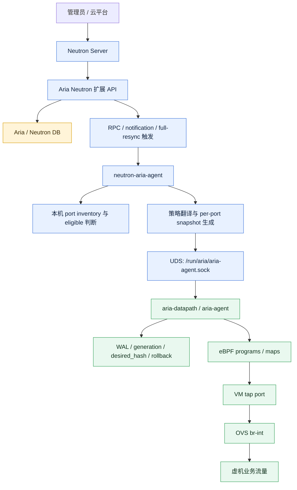
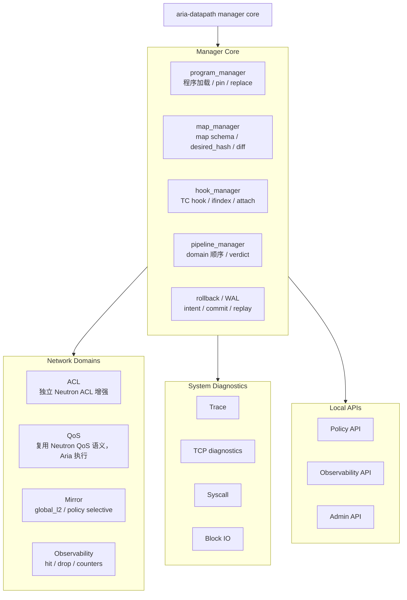
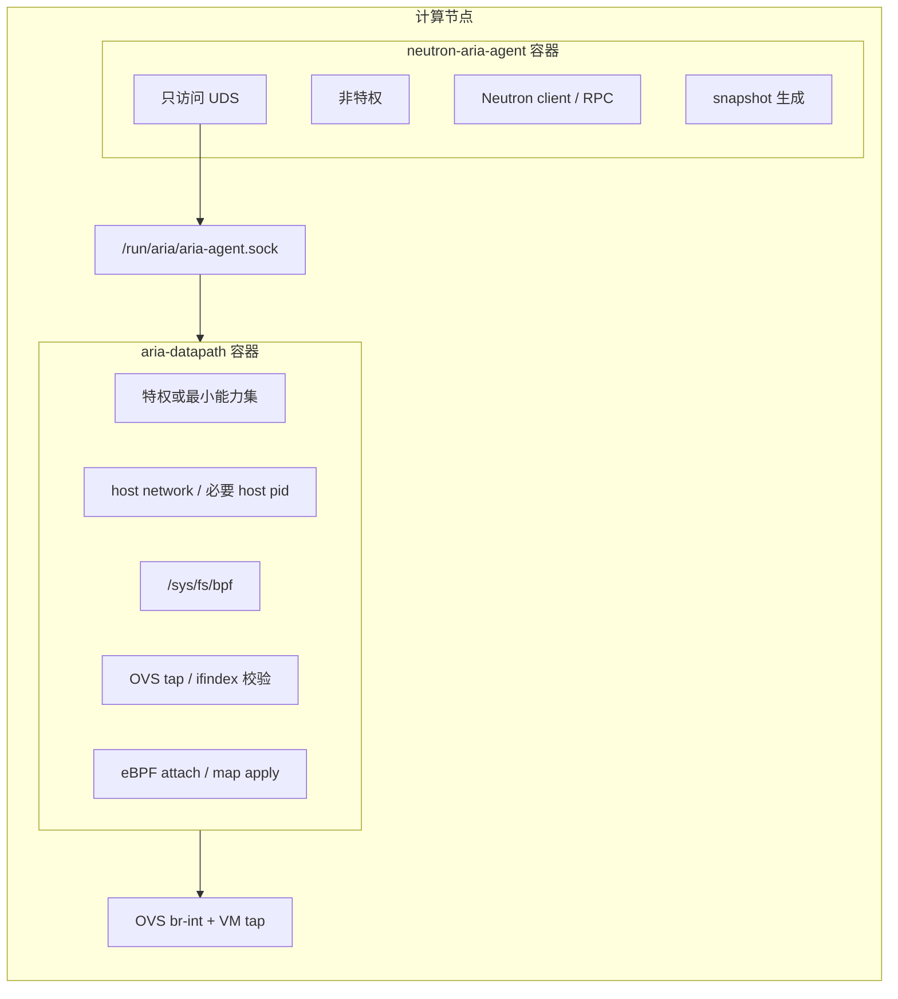
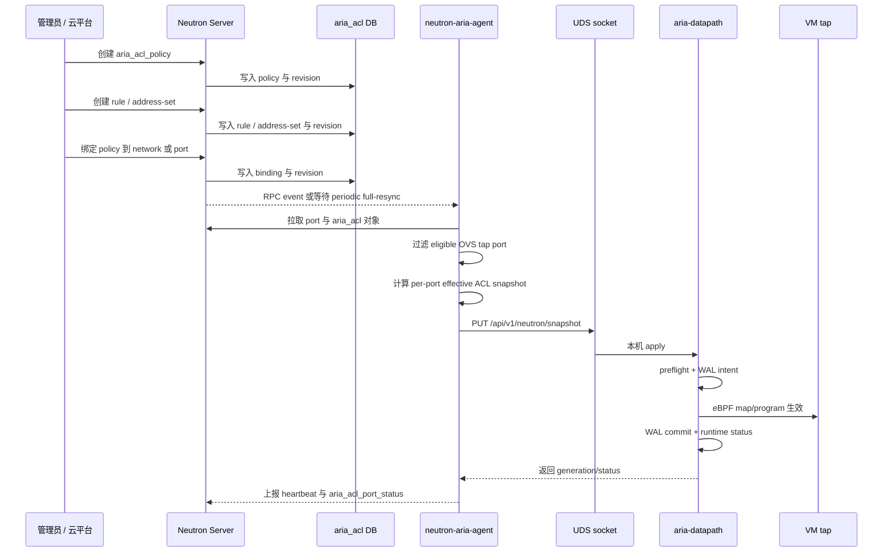
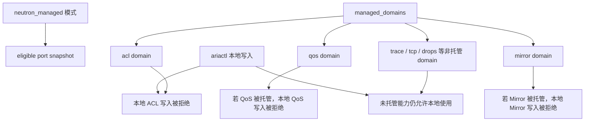
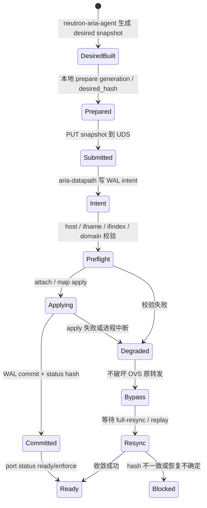
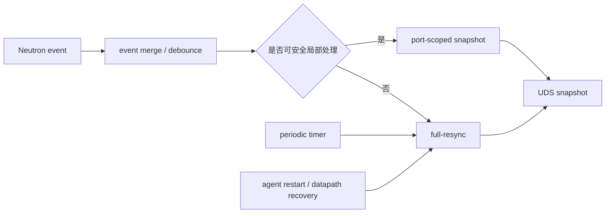
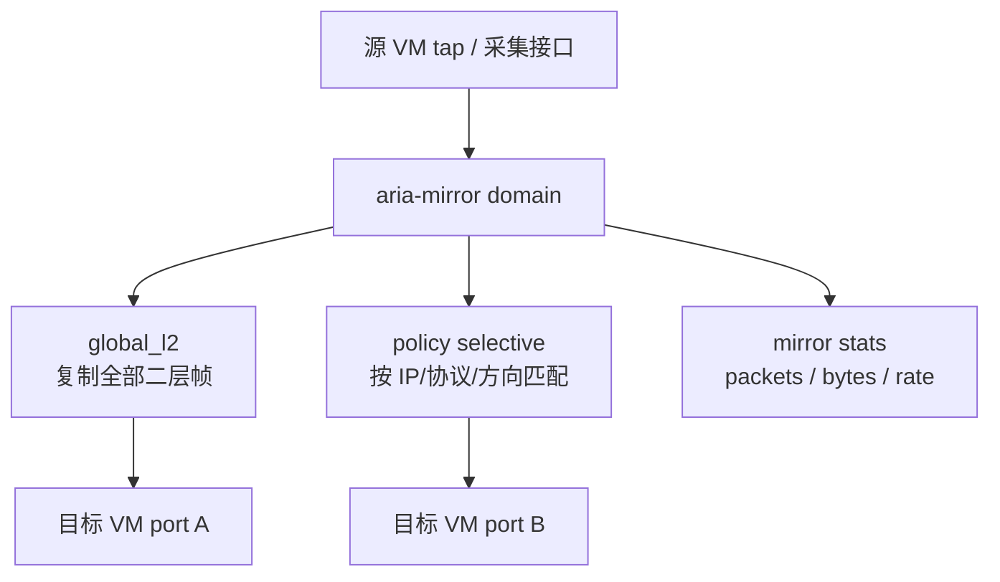
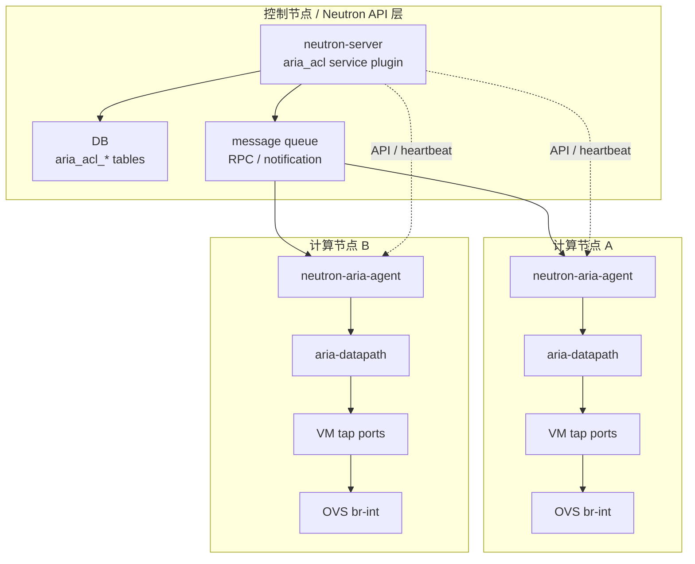

# Aria OpenStack eBPF 数据面增强平台技术分享

本文面向领导、架构同事、开发同事和运维同事，说明 Aria 在 OpenStack/OVS 场景中的产品定位、整体架构、核心调用链、组件边界和后续能力扩展方式。

本文聚焦产品框架、架构边界和核心链路，不作为项目排期文档；它的目标是把方案讲清楚，便于技术分享和方案评审。

## 0. eBPF 能力地图

eBPF 的核心价值不是“又一种包过滤技术”，而是把可验证、可观测、可动态更新的小程序放到内核关键路径上。能力可以按四类理解：

| 能力域 | 具体能力 | 解决什么问题 |
| --- | --- | --- |
| 网络数据面能力 | XDP/TC 可做高速防火墙、ACL、QoS、LB、服务链和流量观测。 | 解决安全策略过滤、异常流量快速丢弃、端口限速、服务链转发和 OpenStack port 级排障问题。 |
| 系统观测能力 | tracepoint、kprobe、uprobe、syscall 可观测内核事件、函数调用、系统调用和用户态函数。 | 解决系统哪里慢、包在哪里丢、IO 为什么慢、TCP 栈哪里异常、哪个进程在读写文件或发起连接的问题。 |
| 安全审计能力 | 通过 exec、open、connect、mount、ptrace 等事件做运行时审计。 | 解决异常命令、敏感文件访问、横向移动、容器逃逸、非法连接和运行时攻击发现/阻断问题。 |
| 性能分析能力 | CPU、off-CPU、IO、内存、锁竞争、函数耗时分析。 | 解决 CPU 忙、IO 慢、fsync 慢、锁等待、函数耗时和应用抖动根因定位问题。 |

OpenStack 场景最有价值的链路是：

```text
port_id -> tap/qvo -> flow -> verdict -> drop reason
```

也就是可以直接把“虚机访问失败”关联到端口、五元组、ACL verdict、rule_id 和 drop reason。

一句话：本产品第一阶段优先收敛网络数据面能力；系统观测、安全审计、性能分析作为后续扩展域，避免过度开发。

## 0.1 当前 eBPF agent 已实现能力

当前代码已经实现的能力不止 ACL，而是一个以 ACL 为主线、兼具治理和观测能力的数据面 agent。

| 能力 | 代码实现情况 | OpenStack 当前接入 | 成熟度判断 |
| --- | --- | --- | --- |
| ACL | XDP/TC hook、IPv4/IPv6、CIDR group、端口范围、rule/group stats、轻量状态跟踪。 | 已接入 `aria_acl`、snapshot、UDS apply、port status。 | 主线已可下发、生效、回滚。 |
| Conntrack | 五元组、反向流量、reply seen、超时、policy 缓存、按 port flush。 | 随 ACL apply 使用。 | 已实现轻量状态跟踪，不是完整 TCP 状态机。 |
| QoS | token bucket、egress shaping/policing、ingress policing、QoS stats。 | 当前未作为 OpenStack 产品闭环主线。 | 代码已有，现场能力受 `tc/qdisc` 约束。 |
| Mirror | per-rule mirror、global mirror、clone redirect、mirror stats。 | 当前未扩展到 OpenStack 产品闭环。 | 本地能力已实现。 |
| Stats | rule stats、flow stats、group stats、drop stats、packets、bytes。 | port status 已接入，页面 counters 展示后续再做。 | 数据面统计能力已具备。 |
| Trace / Drop | packet trace、drop reason、kernel drop tracepoint。 | 主要用于本地诊断和 smoke 证据。 | 已实现诊断能力。 |
| TCPRT | RTT、ART、重传、客户端/服务端方向跟踪。 | 暂未纳入租户产品入口。 | 已实现观测能力。 |
| SSL / HTTP | libssl uprobe、SNI、SSL read/write、HTTP 状态观测。 | 依赖现场 libssl 符号环境。 | 已实现，但属于可选诊断域。 |
| Runtime / WAL | attach/detach、pinned maps、老内核 fallback、generation、desired_hash、WAL、rollback。 | 通过 UDS 与 neutron-aria-agent 对接。 | 已支撑 ACL 生产闭环。 |
| Neutron 集成 | full snapshot、port-scoped snapshot、delete、managed_domains、本地写 gate、RPC/incremental 基础。 | ACL 已闭环；incremental 默认生产关闭。 | ACL 成熟，P3 增量属于渐进开放能力。 |

一句话：当前 agent 的产品成熟主线是 OpenStack ACL；QoS、Mirror、TCPRT、SSL/HTTP、深度 counters 展示属于后续按 domain 逐步产品化的能力。

## 1. 一句话定位

Aria 是一个面向 OpenStack/OVS 环境的 eBPF 数据面增强平台。

它不是 OVS 的替代品，也不是 Neutron Security Group 的替代实现。它的定位是在不改变 OpenStack 原有二层转发、隧道、端口绑定和 Nova/Neutron 协作机制的前提下，为普通虚机 OVS tap 端口增加 ACL、QoS、Mirror 和可观测能力。

```text
Neutron 负责网络对象和产品入口
OVS 负责 OpenStack L2 转发和端口绑定
Aria 负责本机 tap 侧 eBPF 增强执行和运行状态
```

## 2. 背景与目标

现有 OpenStack 环境中，虚机网卡在 Neutron 里表现为一个 port；在计算节点上，普通虚机网卡对应一个 tap 设备，并接入 OVS `br-int`。传统的安全组、QoS 或镜像能力通常依赖 Neutron 自带后端、OVS flow、iptables、tc 或特定 agent 扩展。

Aria 的目标不是重写 OpenStack 网络，而是提供一条更适合产品化扩展的数据面增强路径：

- 北向继续走 Neutron，保证平台入口统一。
- OVS 继续做 L2 switching、隧道、patch port、port binding。
- Aria 只接管明确声明的 OVS tap 端口和明确授权的功能域。
- ACL、QoS、Mirror、观测能力以独立 domain 的形式接入同一个 eBPF Manager。
- 失败时优先保护原业务转发，不因为 Aria 异常主动打断 OVS 基础链路。

## 3. 总体逻辑架构



这张图里最重要的边界是：

- `neutron-server` 是生产 northbound 入口，负责 API、DB、RBAC、对象生命周期和状态读取。
- `neutron-aria-agent` 是 OpenStack 语义适配层，负责从 Neutron 状态计算本机应该生效的 desired state。
- `aria-datapath` 是本机 eBPF 执行面，负责 attach、map、WAL、rollback 和状态收敛。
- OVS 仍然是 OpenStack 原有 L2 转发面，Aria 不改变 Neutron port 的 `binding:vif_type` 语义。

## 4. 产品能力框架

Aria 的产品框架不应该被理解成三个孤立功能点，而应该理解成一个 OpenStack-aware eBPF Manager 加多个功能域。



### 4.1 Manager Core

Manager Core 是本机数据面增强的地基，它负责所有功能域共用的底层能力：

| 子模块 | 职责 |
| --- | --- |
| `program_manager` | 管理 eBPF 程序加载、替换、pin、detach 和版本兼容。 |
| `map_manager` | 管理 BPF map schema、desired state、diff、清理和扩容。 |
| `hook_manager` | 管理 tap 接口 attach、ifindex 对账、TC hook 和未来其他 hook 类型。 |
| `pipeline_manager` | 管理 ACL、QoS、Mirror、观测等 domain 的执行顺序和 verdict。 |
| `rollback/WAL` | 管理本机事务、崩溃恢复、replay、rollback 和状态审计。 |

### 4.2 Network Domains

Network Domains 是面向云网络产品能力的模块：

| 能力域 | 产品入口 | 底层模型 | 说明 |
| --- | --- | --- | --- |
| ACL | `aria-acl` | Aria 独立 ACL API/DB | 不复用 Security Group，面向显式绑定的 port/network 策略。 |
| QoS | `aria-qos` | 复用 Neutron QoS policy/rule 语义 | 产品入口统一叫 Aria QoS，底层不重造 QoS 数据模型，由 Aria 执行。 |
| Mirror | `aria-mirror` | Aria 独立 Mirror API/DB | 支持全局二层镜像和按 IP/协议/方向选择性镜像。 |
| Observability | `aria-observability` | 只读观测 API | 输出 rule hit、drop reason、PPS/BPS、per-port runtime status。 |

### 4.3 System Diagnostics

Trace、TCP、syscall、block IO 等属于诊断能力，不应该默认进入虚机网络转发热路径。

原则是：

- 默认关闭。
- 按端口、虚机、租户、进程或时间窗口显式启用。
- 只做观测，不改变业务转发。
- 不作为 v0.9 的 Neutron tenant API 主线。

## 5. 组件职责边界

| 组件 | 职责 | 不负责 |
| --- | --- | --- |
| Neutron Server | Aria ACL API/DB/RBAC、policy/rule/address-set/binding CRUD、状态读回、after-commit notification。 | 不直接写 eBPF，不直接管理本机 tap attach。 |
| neutron-aria-agent | 读取 Neutron 对象，监听 RPC，做 full-resync，计算 effective snapshot，上报 heartbeat 和 port status。 | 不读写 eBPF map，不挂载 bpffs，不直接修改 OVS flow。 |
| aria-datapath | 本机 UDS API、tap/ifindex 校验、eBPF attach/map apply、WAL、rollback、runtime status。 | 不访问 Neutron DB，不做租户级 API，不替代 Neutron Server。 |
| OVS agent / OVS | 继续负责 OpenStack 原生 OVS port binding、br-int、隧道、L2 转发。 | 不负责 Aria ACL 策略语义。 |
| ariactl | 本地读、调试、非 Neutron 托管 domain 的手工管理。 | 不能覆盖 Neutron 已托管 domain 的写权限。 |

### 5.1 两容器部署形态



这个拆分让控制面和数据面权责清晰：

- `neutron-aria-agent` 是非特权逻辑 agent。
- `aria-datapath` 是本机特权数据面执行容器。
- 两者只通过本地 Unix socket 通信。
- 生产环境不让 Python agent 直接接触 eBPF、bpffs 或 OVS 底层资源。

## 6. ACL 业务流程

Aria ACL 的 northbound 入口是 Neutron Server，只是不复用 Security Group 的默认安全组和自动绑定逻辑。



关键点：

- 未绑定 Aria ACL 的 port 保持 bypass。
- 不修改 Neutron port 的 `binding:vif_type`、`binding:vnic_type`、`device_owner` 等原生字段。
- Aria ACL 状态通过独立 status 表或扩展字段表达，不塞进 Neutron 原生 port 主字段。
- 对不支持的端口类型，状态应表达为 `unsupported` 或 `not_applicable`，而不是静默失败。

## 7. 为什么不复用 Security Group

Aria ACL 和 OpenStack Security Group 的业务语义不同。

| 对比项 | Security Group | Aria ACL |
| --- | --- | --- |
| 产品定位 | OpenStack 默认虚机安全组 | 独立 ACL enhancement |
| 默认行为 | 通常存在 default SG 和自动绑定逻辑 | 无显式绑定则 bypass |
| 数据模型 | security_group / security_group_rule | aria_acl_policy / rule / address_set / binding |
| 执行后端 | iptables、OVS firewall、OVN ACL 等 | Aria eBPF datapath |
| 端口绑定 | 与 port security、安全组字段强相关 | 独立 binding，不修改 port binding 字段 |
| 适用场景 | OpenStack 原生安全组体系 | 平台自定义 ACL、审计、后续可观测和高性能执行 |

当前产品环境里 Security Group 可以是关闭状态，所以 Aria ACL 不应被描述成“替代安全组”。更准确的说法是：

```text
Aria ACL 是独立的 Neutron ACL enhancement，入口走 Neutron，执行走 Aria eBPF。
```

## 8. Port 字段与 Aria 状态表达

一个虚机网卡在 Neutron 里仍然是普通 port。使用 Aria 以后，下面这些字段不应该变成 `aria` 或 `ebpf`：

| 字段 | 是否由 Aria 修改 | 原因 |
| --- | --- | --- |
| `binding:vif_type` | 否 | 仍然由 ML2/OVS mechanism driver 表达虚机如何接入 OVS。 |
| `binding:vif_details` | 否 | 仍然是 Nova/libvirt/OVS 接口细节。 |
| `binding:vnic_type` | 否 | 用于 normal/direct/macvtap 等类型判断。 |
| `device_owner` | 否 | 仍然表示 Nova、DHCP、router 等端口归属。 |
| `security_groups` | 否 | Aria ACL 不复用 Security Group。 |
| `qos_policy_id` | 视 QoS 路线而定 | QoS 可复用 Neutron QoS 语义，但产品入口可包装成 Aria QoS。 |

Aria 状态应通过独立对象表达：

```text
aria_acl_policy
aria_acl_rule
aria_acl_address_set
aria_acl_binding
aria_acl_port_status
```

旧版 CLI 可以提供类似：

```text
neutron aria-acl-policy-list
neutron aria-acl-rule-list <policy>
neutron aria-acl-binding-list
neutron aria-acl-port-status-show <port>
```

也可以在 `neutron port-show` 中展示摘要字段，例如：

```text
aria_acl_status
aria_acl_effective_action
aria_acl_policy_ids
aria_acl_runtime_host
aria_acl_generation
```

但这些字段只是摘要，权威对象仍然是 Aria ACL 独立 API/DB。

## 9. Neutron-managed 与 managed_domains

Aria 需要同时满足两个需求：

1. OpenStack 产品模式下，Neutron 应该拥有 ACL/QoS/Mirror 等功能域的写权限。
2. 本地 `ariactl` 仍然可以用于调试、观测和非 Neutron 托管能力。

因此控制权分两层：



规则是：

- `neutron_managed` 决定 attach/detach 权限是否由 Neutron snapshot 管理。
- `managed_domains` 决定每个功能域的写权限归谁。
- 如果只配置 `managed_domains=["acl"]`，则 Neutron 只拥有 ACL；QoS、Mirror、Trace、Drops 等仍可由本地工具使用。
- 对同一个 tap port，Neutron 托管的 domain 和本地未托管 domain 可以共存，但不能多写同一个 domain。

## 10. 事务性与失败恢复

Aria 不追求跨 Neutron DB、Python agent、Rust datapath、eBPF map 的分布式强 ACID。更适合当前产品场景的是最终一致、可恢复、可审计的事务模型。



事务模型的关键机制：

- Neutron DB 内部 CRUD 和 revision 更新必须在同一 DB transaction 中完成。
- RPC/notification 应在 DB commit 后发送。
- notification 丢失时，由 periodic full-resync 兜底。
- Python agent 使用 generation、desired_hash、pending snapshot/delete 记录本地意图。
- Rust datapath 使用 WAL intent/commit/replay 处理进程崩溃和重启恢复。
- 单 port 或单 domain 失败时，应该尽量只标记该 port/domain degraded，不拖垮其他 port。
- apply 失败时默认进入 bypass，优先保证 OVS 原业务转发不被破坏。

## 11. 同步模型

Aria 的同步模型分三类：

| 同步方式 | 作用 | 产品建议 |
| --- | --- | --- |
| periodic full-resync | 启动、恢复、纠偏和最终一致权威路径。 | 必须保留。 |
| RPC-triggered full-resync | 收到 Neutron 事件后加速触发全量同步。 | 可作为默认优化路径。 |
| port-scoped apply | 只针对单 port 下发局部 snapshot，降低收敛延迟。 | 需要 revision-aware gate，默认谨慎开启。 |



full-resync 是系统的权威纠偏路径，不能因为引入 RPC 或增量 apply 就删除。

## 12. ACL 执行语义

ACL 以 VM tap 视角定义方向：

| 方向 | 含义 |
| --- | --- |
| ingress | 外部进入 VM tap 的流量。 |
| egress | VM tap 发出的流量。 |

策略对象包括：

- `policy`：策略容器。
- `rule`：匹配条件和 action。
- `address-set`：IP/CIDR 集合。
- `binding`：将 policy 绑定到 port 或 network。
- `port-status`：运行时状态、host、generation、effective_action。

基础原则：

- 未绑定策略不改变流量。
- 策略绑定但当前端口不支持时，状态要可见。
- 策略下发失败时不能假装 `ready`。
- runtime status 必须能说明：哪个 port、哪个 host、哪个 generation、当前是否 enforce、是否 bypass、原因是什么。

## 13. QoS 路线

QoS 不建议重造一套全新的 QoS API。更合理的路线是：

```text
产品入口叫 aria-qos
底层语义复用 Neutron QoS policy/rule
执行后端由 Aria eBPF datapath 完成
```

这样可以避免两套 QoS 数据模型，也更容易和 OpenStack 原生命令、Horizon 或平台后端集成。

建议产品表达：

| 层次 | 命名 |
| --- | --- |
| 产品入口 | Aria QoS / `aria-qos` |
| 底层语义 | Neutron QoS policy/rule |
| 执行后端 | Aria datapath |
| 状态表达 | Aria QoS runtime status |

QoS 需要避免和 OVS agent QoS、tc、已有定制 QoS 插件形成双重限速。产品化前必须明确：

- QoS API 是否可见。
- QoS policy 如何绑定到 port/network。
- Aria 是否拥有该 port 的 QoS domain 写权限。
- eBPF 执行路径是 shaping、policing-only，还是声明 unsupported。
- 失败时如何 rollback 和 bypass。

## 14. Mirror 路线

Mirror 建议做成 `aria-mirror` 独立扩展，而不是混用现有 mirror API 语义。

原因是 Aria Mirror 的核心语义是：

```text
对 Aria 管理的源 port / 源接口复制流量，并投递到明确的目标 port / 目标接口
```

它需要同时支持：

- `global_l2`：接近交换机 SPAN 的全二层帧镜像。
- `policy`：按 IP 网段、协议、方向选择性镜像。
- `target`：明确目标 VM port 或目标接口。
- `stats`：镜像包数、字节数、速率和失败原因。



产品语义建议：

- `global` 就等于 `global_l2`，默认复制源接口上的全部二层帧。
- IP policy mirror 只匹配可解析的 IP 流量。
- ARP、LLDP、未知 EtherType、广播、多播等非 IP 二层流量由 global mirror 覆盖。
- 不建议把现有 mirror API 中有歧义的 `port_id` 字段强行改造成 Aria source 语义。

## 15. 可观测性与产品差异化

Aria 的长期价值不只是“能拦包”，而是能把 eBPF 数据面状态映射回 OpenStack 语义。

可观测输出应该能回答：

- 哪个 tenant、哪个 VM、哪个 Neutron port 受影响。
- 哪条 ACL rule 命中。
- 当前 action 是 allow、deny、bypass、unsupported 还是 degraded。
- drop 的原因是什么。
- 每个 port 的 PPS/BPS、包数、字节数是多少。
- Mirror 是否投递成功、投递到哪个 target。
- QoS 是否真正生效，限速计数是否增长。

推荐 API 分层：

| API 类型 | 消费者 | 作用 |
| --- | --- | --- |
| Policy API | Neutron / 平台控制面 | 创建和下发 ACL、QoS、Mirror 策略。 |
| Observability API | 监控、审计、平台 UI | 查询 counters、drop reason、rule hit、速率和事件。 |
| Admin API | 运维、支持工具 | 查看 capabilities、WAL、attach、map、rollback、health。 |

## 16. 支持与不支持的端口类型

当前产品语义建议只接管普通 OVS tap port。

| 端口类型 | Aria 处理建议 | 原因 |
| --- | --- | --- |
| 普通 Nova VM OVS tap | 支持 | tap 接入 br-int，适合 TC/eBPF attach。 |
| DHCP / Metadata / Router 服务端口 | 不默认接管 | 属于云平台服务路径，误接管风险高。 |
| SR-IOV direct port | unsupported | 数据面绕过普通 tap/OVS 路径。 |
| LinuxBridge port | unsupported 或 not_applicable | 不属于当前 OVS tap 主路径。 |
| 物理采集口 | 可作为独立采集接口能力评估 | 需要明确接线、target 和 mirror 语义。 |

端口判定必须由 `neutron-aria-agent` 和 `aria-datapath` 双重校验：

- agent 根据 Neutron port、binding host、device owner、vnic type、OVS external_ids 做逻辑筛选。
- datapath 根据本机 ifname、ifindex、tap 存在性和权限做最终防线。

## 17. 典型部署与运行关系



每个计算节点都只负责本机 port：

- 不跨节点直接修改对方 datapath。
- VM 迁移后，旧 host 负责清理旧 tap，新 host 通过 full-resync 接管新 tap。
- 旧 host 清理失败时应可见、可重试、可降级，不应悄悄残留不可解释状态。

## 18. Fail-open 与 OVS 转发保护

### 18.1 总原则

这里有一条必须坚持的产品原则：

```text
Aria ACL 是 OVS 业务转发链路上的安全增强，不是 OVS 转发本身的依赖。
最坏结果必须是 ACL 降级或旁路，不能因为 Aria/eBPF 故障导致原本可通的 OVS 业务中断。
```

因此在设计上要把两个概念分开：

- **原始转发能力**：由 Neutron、OVS、bridge、tunnel、tap 等原有链路保证。
- **ACL 增强能力**：由 Aria 在普通 VM tap 上追加 eBPF enforcement。

Aria 可以影响 ACL 是否生效，但不应该成为 OVS forwarding 的单点依赖。

### 18.2 端口挂载与 ACL 生效

| 场景 | eBPF 是否可能挂载 | ACL 是否生效 | OVS 原转发 |
| --- | --- | --- | --- |
| 普通 VM OVS tap，未绑定 ACL | 当前可能预挂载，但 ACL gate 为 `not_requested + bypass` | 不生效 | 保持 |
| 普通 VM OVS tap，绑定 ACL 且 apply 成功 | 挂载 | `ready + enforce` 后生效 | 保持 |
| 普通 VM OVS tap，绑定 ACL 但 apply 失败 | 尝试挂载或回滚 | `degraded + bypass` 或保持上一版 committed 状态 | 保持 |
| DHCP、metadata、qrouter、qdhcp、patch 等服务端口 | 不应接管或标记 `not_applicable` | 不生效 | 保持 |
| tap 被删除 | 旧 attach 随 netdev 消失 | 不生效，状态进入 detached/cleanup | OVS 按原生命周期处理 |

分享时要特别强调：**挂载 eBPF 不等于 ACL 正在 drop 流量**。只有端口进入 `ready + enforce`，且 port 级 gate 打开，才允许发生 deny/drop。

### 18.3 组件故障场景

| 故障场景 | ACL 行为 | OVS 业务转发 | 设计要求 |
| --- | --- | --- | --- |
| `neutron-aria-agent` 停止 | 已下发 ACL 通常继续按旧状态工作；新策略不会同步 | 不受影响 | heartbeat 变 stale，恢复后 full-resync |
| `aria-agent` / `aria-datapath` 停止 | 已挂载 ACL 是否继续取决于 pinned link/map 与内核状态，不能承诺永远生效 | 不受影响 | 状态 degraded/stale，恢复后 reconcile |
| eBPF attach 失败 | ACL 不生效或回滚旧状态 | 不受影响 | 记录 attach failure，不阻断 OVS |
| map 更新或 apply 失败 | 保持上一版 committed，或进入 bypass | 不受影响 | WAL/generation 保证无半状态 |
| OVS 重启或 datapath 中断 | ACL 不负责恢复 OVS | OVS 自身中断 | Aria 只做 netdev/attach 状态重建，不主动重启 OVS |
| tap 删除后重建 | 旧 attach 消失，新 tap 需要重新识别和挂载 | 按 OVS 生命周期恢复 | full-resync/RPC/lifecycle smoke 覆盖 |

这张表里最关键的是边界：**Aria 可以感知 OVS/tap 生命周期来恢复 ACL，但不能把自己设计成 OVS 的控制器，更不能主动重启 OVS 或 OVS agent。**

### 18.4 实现机制

Fail-open 不是一句口号，而是几层一起保证：

1. 控制面先判断端口是否应该被 Aria 管理。没有 binding、没有 policy、不支持的端口类型，直接输出 `bypass/not_applicable`。
2. apply 顺序采用安全更新：先关闭端口 ACL gate，再清理旧规则，写入新 group/policy/rule，最后打开 gate。
3. WAL、generation、desired_hash 确保 apply 可恢复、可审计，失败时不会留下不可解释的半状态。
4. eBPF 热路径默认放行：XDP 路径默认 `XDP_PASS`，TC 路径默认 `TC_ACT_OK`。
5. map miss、未知协议、未启用端口、未 ready domain 都不能默认 drop。
6. 只有 `ready + enforce` 的端口和方向，才允许进入 deny/drop 逻辑。

因此故障时的优先级是：

```text
保护 OVS 转发 > 保持上一版已提交 ACL > ACL degraded/bypass > 新策略即时生效
```

### 18.5 后续开发硬约束

后续继续开发 ACL/RPC/P3 增量下发时，需要把这些约束当成硬规则：

1. Aria 生产逻辑严禁主动重启 OVS、OVS agent 或 neutron-server。
2. eBPF 默认动作必须是 pass，不能把未知状态设计成 drop。
3. 未纳管、未绑定、未 ready、未 enforce 的端口不能 drop。
4. apply 失败时只能回到上一版 committed 状态，或进入 degraded/bypass。
5. service port、patch port、qrouter/qdhcp、metadata 等端口必须显式 `unsupported/not_applicable + bypass`。
6. OVS forwarding 健康和 ACL enforcement 健康要分开观测，不能把 OVS 中断误判成 ACL 中断。

## 19. 对业务方的产品话术

推荐说法：

```text
Aria 为 OpenStack 普通虚机 OVS tap 端口提供独立 ACL 增强能力。
控制面走 Neutron，数据面走本机 eBPF。
它不替换 OVS，不依赖 Security Group，不改变虚机原有接入模型。
```

对于 QoS：

```text
Aria QoS 的产品入口保持统一命名，底层复用 Neutron QoS 策略语义。
后续由 Aria datapath 执行，避免重新发明一套 QoS 模型。
```

对于 Mirror：

```text
Aria Mirror 是面向 Aria 管理接口的独立镜像能力。
它支持接近交换机 SPAN 的 global_l2，也支持按 IP/协议/方向做选择性镜像。
```

对于失败行为：

```text
Aria 异常时优先进入 degraded/bypass，不主动破坏 OVS 原有转发。
运行状态会通过 Neutron agent heartbeat 和 Aria port status 暴露。
```

## 20. 分享时建议强调的结论

1. Aria 是 OpenStack/OVS-aware eBPF 数据面增强平台，不是 OVS 替代品。
2. Neutron Server 是唯一生产 northbound，Aria 不绕过 Neutron 创建租户级网络策略。
3. ACL 使用独立 `aria-acl` 扩展，不复用 Security Group。
4. QoS 产品入口叫 `aria-qos`，但底层复用 Neutron QoS policy/rule 语义。
5. Mirror 建议使用独立 `aria-mirror`，避免复用已有 mirror API 的歧义语义。
6. `neutron-aria-agent` 是非特权适配层，`aria-datapath` 是本机特权执行层。
7. `managed_domains` 允许每个能力域独立选择 Neutron 托管或本地手工管理。
8. 事务模型是最终一致、可恢复、可审计，而不是跨系统分布式强事务。
9. 可观测性是产品差异化方向：rule hit、drop reason、per-port counters、runtime status。
10. 产品边界必须清晰：当前主路径面向普通 OVS tap，SR-IOV、LinuxBridge 和服务端口不默认接管。
