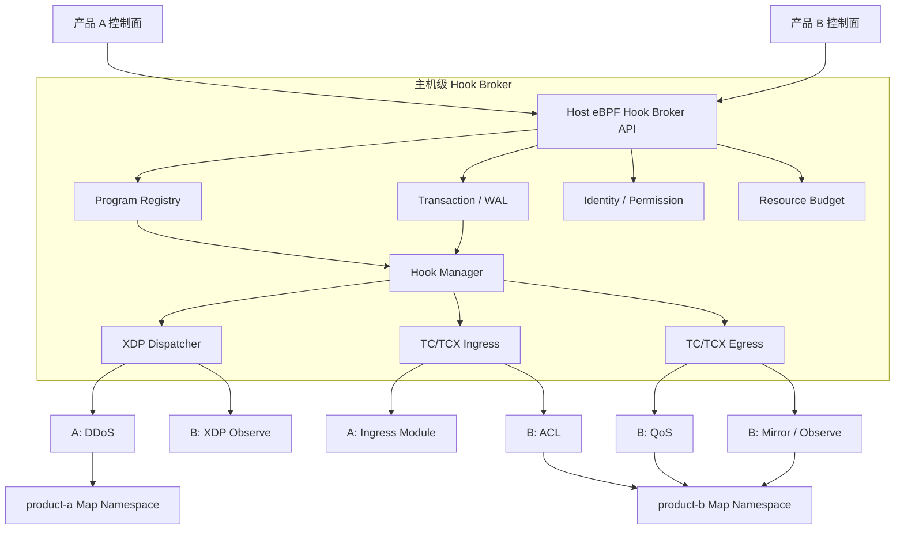
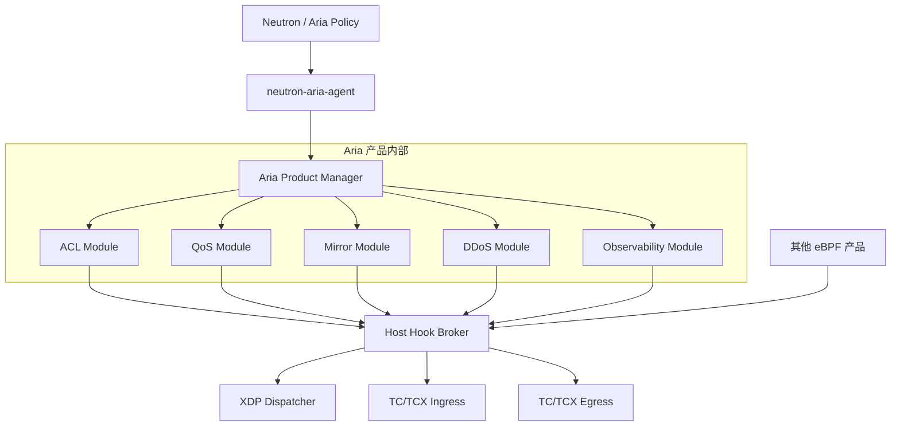

# 大型 eBPF 产品与多产品 Hook Broker 架构

状态：目标架构与当前实现差距说明。本文不是当前 v0.9 已交付能力声明，
也不授权在未完成内核能力验证、兼容性测试和回滚门禁前直接改造生产数据面。

相关文档：

- [OpenStack eBPF Platform Roadmap](openstack-ebpf-platform-roadmap.md)
- [Aria Tail-Call Datapath Architecture](superpowers/specs/2026-08-16-tail-call-datapath-architecture-design.md)
- [XDP Storm And DDoS Product Integration](superpowers/specs/2026-08-04-xdp-storm-ddos-product-integration-design.md)
- [OpenStack Neutron Aria Design Decisions](openstack-neutron-aria-design-decisions.md)

## 1. 问题定义

当一个主机上同时运行两个复杂 eBPF 产品 A 和 B 时，不能让两个产品分别把
XDP/TC 当成自己的私有资源。即使某个内核钩子允许多程序挂载，产品仍可能在
升级、detach、优先级、返回动作、Map、CPU 和状态恢复方面互相影响。

例如：

- A 是 XDP DDoS 产品，B 是 TC ACL 产品；
- A 和 B 都需要 TC ingress；
- A 更新时删除了整个 clsact qdisc，导致 B 的 filter 同时消失；
- A 返回 DROP 或 REDIRECT，B 不再看到该报文；
- A 的观测事件无界上报，占满 CPU 或 ring buffer，拖慢 B；
- A 和 B 使用相同 bpffs 路径、Map 名称或旧 link pin，恢复时错误认领对方对象。

本文将“互不影响”定义为以下可实现目标：

1. 生命周期隔离：A 的加载、升级、回滚和删除不会误删 B。
2. 状态隔离：策略、Map、WAL、generation、日志和计数按产品隔离。
3. 故障隔离：A 失败可独立 degraded/bypass，不破坏 B 的已提交状态。
4. 顺序确定：同一钩子上的执行顺序和终止动作有显式契约。
5. 资源治理：A 不能无界占用 Map、CPU、ring buffer 或事件出口。
6. 行为可解释：可以判断一个报文在哪个产品、模块和规则被处理或终止。

本文不承诺报文语义绝对隔离。A 如果先执行并返回 DROP，B 必然看不到该报文；
A 如果修改报文，B 看到的是修改后的报文。平台要保证的是这种影响是经过声明、
排序、审计和测试的，而不是偶然发生。

## 2. 核心决策

大型单产品采用“产品 Manager + 模块化数据面”；多个独立产品共存时，在产品
Manager 之下增加唯一的主机级 `host-ebpf-hook-broker`。

任何产品都不得绕过 Broker 直接创建、替换或删除共享 XDP/TC hook。



## 3. 三层职责

### 3.1 主机级 Hook Broker

Broker 是共享内核 hook 的唯一所有者，负责：

- 维护 `(netns, ifindex, hook, direction)` 级注册表；
- 创建和维护 XDP dispatcher、clsact、TC/TCX attach；
- 分配并校验 priority、slot、TC handle 和 link identity；
- 校验程序类型、ABI、版本、哈希和内核能力；
- 执行 prepare、attach、activate、commit、rollback；
- 检测 foreign attachment、stale pin、missing link 和顺序漂移；
- 提供产品级资源配额、健康状态、审计和故障隔离；
- 只删除已证明由该产品和事务拥有的对象。

Broker 不理解 ACL、DDoS、QoS 等业务策略，只理解程序、hook、执行契约、资源和
生命周期。

### 3.2 产品级 Manager

每个产品继续保留自己的策略和业务编排：

```text
product-manager
  policy compiler
  desired state
  product transaction
  module status
  modules
    acl
    ddos
    qos
    mirror
    observability
```

产品 Manager 把策略编译成 Map 内容和模块版本，通过 Broker 注册/更新数据面。
它不能直接把共享接口上的 qdisc、XDP link 或其他产品 link 当作自己的资源。

### 3.3 eBPF 数据面模块

模块应按职责拆分，避免一个不断增长的超级程序：

- parse/classify；
- DDoS/storm early guard；
- ACL；
- QoS；
- Mirror；
- flow/drop observability；
- trace/TCP/syscall/block IO 等默认关闭的诊断模块。

同一产品内部可以共享经过版本化的 ABI 和少量基础 Map。不同产品默认不共享
业务 Map；确需共享时，Map 必须由 Broker 所有并有独立 ABI。

## 4. Program Manifest

所有模块在挂载前必须提交 Manifest。最低字段如下：

```yaml
product_id: product-b
module_id: acl-ingress
module_version: 1.2.0
program_hash: sha256:example
hook: tc_ingress
priority: 120
mode: enforce
continue_on:
  - continue
terminal_actions:
  - drop
  - redirect
fail_policy: fail_open
abi_version: host-hook-v1
map_namespace: /sys/fs/bpf/products/product-b/acl
map_memory_limit: 268435456
event_rate_limit: 10000
cpu_budget_ns: 800
```

Manifest 必须作为 desired state 和审计记录的一部分。仅靠程序名、pin 文件名或
加载顺序不能成为产品级所有权依据。

## 5. Pipeline 与 verdict 契约

推荐阶段：

```text
Stage 10  parse / classify
Stage 20  DDoS / storm early guard
Stage 30  ACL / security policy
Stage 40  transform / mark
Stage 50  QoS
Stage 60  mirror
Stage 70  observability
```

平台内部统一使用：

```text
CONTINUE  执行下一模块
PASS      终止模块链并放行
DROP      终止并丢弃
REDIRECT  终止并重定向
CLONE     复制报文，原报文继续
BYPASS    当前模块不适用，继续
ERROR     按 fail_policy 处理
```

内核后端负责把统一 verdict 转换为 `XDP_*`、`TCX_*` 或 `TC_ACT_*`。禁止让各产品
自行定义相互矛盾的继续语义。

以 DDoS A 和 ACL B 为例：

```text
NIC
  -> A DDoS
       DROP/REDIRECT -> terminal
       CONTINUE      -> B ACL
                          DROP -> terminal
                          PASS -> network stack / OVS
```

最终允许语义为 `A allow AND B allow`。ACL 只覆盖 DDoS 清洗后流量，必须分别展示
`ddos_seen/drop`、`acl_seen/drop` 和 `delivered`，不能把 B 未看到的报文算作 B 的
ACL 未命中。

## 6. Hook 后端

| 环境 | XDP | TC | 产品约束 |
| --- | --- | --- | --- |
| 当前 4.18 兼容线 | 自研固定 dispatcher，或同接口只允许一个 XDP 产品 | Legacy TC ownership 或固定 dispatcher | 必须依靠精确 program identity、priority/handle 和恢复门禁 |
| 具备 libxdp 能力的内核 | libxdp multiprog dispatcher | Legacy TC 或受控 dispatcher | 所有 XDP 产品必须遵循同一 dispatcher 协议 |
| Linux 6.6+ 目标线 | libxdp | TCX/BPF link | 使用显式 before/after、relative link 和 expected revision |

旧内核不应伪装成具备现代 multiprog 能力。若没有经过验证的 XDP dispatcher，
Broker 必须拒绝第二个 XDP 产品，而不是尝试覆盖已有程序。

## 7. Map、状态和权限隔离

推荐目录：

```text
/sys/fs/bpf/host-ebpf-broker/
  hooks/
  shared-abi/
  products/
    product-a/
      programs/
      maps/
      links/
    product-b/
      programs/
      maps/
      links/
```

目录隔离只解决命名和生命周期边界，不等于完整安全隔离。还必须配合：

- 独立服务用户和组；
- bpffs 目录权限和必要的 mount namespace；
- 最小化 `CAP_BPF`、`CAP_NET_ADMIN`、`CAP_PERFMON`、`CAP_SYS_RESOURCE`；
- 非特权产品控制面只访问 Broker API；
- Broker 校验 peer identity 和 product identity；
- 禁止产品传入任意 pin path 或要求删除未证明所有权的对象。

## 8. 事务、升级和恢复

Hook 更新必须执行：

```text
validate manifest and kernel capability
  -> write WAL intent
  -> load and verify inactive program generation
  -> stage shadow maps/program bank
  -> attach inactive link/slot
  -> health and identity check
  -> atomically activate generation
  -> write WAL commit
  -> delayed cleanup of old generation
```

要求：

- 报文只看到完整旧版本或完整新版本；
- 相同 desired hash 重试不重复 apply；
- A 更新失败只回滚 A，不触碰 B；
- Broker 重启后同时对账 WAL、pin、link、ifindex、program ID 和执行顺序；
- 一个产品的 transaction 不能把另一个产品的状态包含进自己的 cleanup plan；
- joint pipeline 顺序变化由 Broker 单独执行 hook-level transaction。

## 9. 资源与可观测性

每个产品和模块至少暴露：

- program/link ID、hook、priority、active generation；
- packets、bytes、drop、redirect、bypass、error；
- 平均和分位运行时间，或可获得的 BPF run-time 指标；
- Map 当前容量、最大容量和内存预算；
- ring buffer/perf event 产生、丢失和限流数；
- verifier/load/attach/apply/rollback 状态；
- terminal verdict 的 product/module/rule/reason；
- foreign attachment、identity mismatch 和 order drift。

观测模块必须支持采样和速率限制。一个观测模块失效时应 bypass，不能影响转发。

## 10. 成熟项目参考与设计取舍

大型 eBPF 项目普遍采用“节点级统一管理者”，但它们解决的问题层次并不相同。
Aria 不直接复制某一个项目，而是分别吸收其已经验证的边界。

| 项目 | 已验证的设计模式 | Aria 采纳内容 | 不直接照搬的部分 |
| --- | --- | --- | --- |
| [Cilium](https://docs.cilium.io/en/stable/overview/component-overview/) | 节点 Agent 统一管理 endpoint、program、Map、策略和恢复；内部使用多个 hook 和 tail call 组织复杂数据面 | 产品级 Manager、port 生命周期、内部 pipeline、Map 持久化、状态与可观测性分层 | Cilium 的内部 pipeline 不是通用第三方插件接口，也不代表任意产品已经可以共享 hook |
| [Calico Felix](https://docs.tigera.io/calico/latest/reference/architecture/overview) | 节点 Agent 持续对账接口、路由、ACL 和状态；现代内核优先使用 TCX | desired-state reconcile、周期对账、TCX 能力探测和第三方共存意识 | Calico 的 Kubernetes 数据面和路由职责不引入 OpenStack/OVS 产品范围 |
| [Tetragon](https://tetragon.io/docs/concepts/tracing-policy/) | TracingPolicy/Sensor 可动态加载，策略来源按 domain 隔离，在内核过滤并限制事件出口 | observability 模块、策略域、事件采样/限速、动态启停 | tracing hook 不与网络 hot path 共用同一业务 API 和事务 |
| [libxdp](https://github.com/xdp-project/xdp-tools/blob/master/lib/libxdp/README.org) | XDP dispatcher、run priority、chain-call actions、component pin | 现代内核 XDP multiprog 后端和 verdict 继续条件 | 当前 4.18 兼容线不能假设具备完整动态 multiprog 能力 |
| [bpfman](https://bpfman.io/v0.6.0/getting-started/cli-guide/) | 通用程序加载、身份、priority、proceed-on、dispatcher 和受控生命周期 | 独立 Host Hook Broker 的接口和资源治理参考 | 不把 bpfman 的通用加载 API 直接暴露为 Aria 业务策略 API |

这些项目共同证明了四件事：

1. 一个产品内部必须有唯一节点级 Manager，不能让各业务模块分别争抢 hook。
2. 业务策略、program 生命周期、Map 生命周期和观测出口需要分层。
3. tail call 适合产品内部流水线，但不是天然安全的第三方插件协议。
4. 多个独立产品共享 hook 需要独立的身份、顺序、资源和事务协调层。

Cilium 也不能被理解成通用 Hook Broker。其公开产品架构以
`cilium-agent` 统一拥有 Cilium 数据面为中心；第三方程序与 Cilium TCX 程序的
稳定顺序和中央协调仍是独立问题。Aria 因此采用“两层 Manager”目标，而不是
把当前 `aria-datapath` 直接包装成无限制的第三方加载器。

## 11. Aria 采纳的目标模型

### 11.1 两层 Manager



近期 `aria-datapath` 同时承载 Aria Product Manager 和 Aria 内部 hook owner，
但接口必须按 `program_manager`、`map_manager`、`hook_manager`、
`pipeline_manager` 拆分。只有进入多产品交付阶段时，才把通用 hook 生命周期
提取为中立 Host Hook Broker；届时 Aria 变成 Broker 的一个产品客户端。

### 11.2 Aria 内部 pipeline 契约

Aria 内部模块使用固定 stage、固定 metadata ABI 和固定 verdict，不允许模块自行
决定 attach priority 或清理共享 qdisc：

```text
XDP ingress
  -> ddos/storm
  -> xdp observability
  -> PASS/DROP/REDIRECT

TC ingress/egress
  -> parse
  -> port context
  -> connection tracking
  -> ACL
  -> QoS
  -> Mirror
  -> observability result
  -> final verdict
```

具体模块可以关闭，关闭的 slot 必须安全 fall-through。内部 tail-call slot 不作为
第三方 API；第三方产品只能通过未来 Broker 的 Manifest 注册。

### 11.3 Port 生命周期

参考成熟产品的 endpoint regeneration，Aria port 统一使用以下逻辑状态：

```text
discovered
  -> eligible
  -> preparing
  -> applying
  -> ready

ready/applying
  -> degraded
  -> recovering
  -> applying

ready/degraded
  -> deleting
  -> detached
```

每次状态变化都必须携带 `port_id`、host、ifindex、generation、desired hash、
active program generation、domain status 和 last error。只有 program/link/Map
identity 与 desired state 全部收敛后才能进入 `ready`。

### 11.4 Map 和 API 分层

Map 分为四类：

| 层次 | 内容 | 生命周期 |
| --- | --- | --- |
| runtime global | program identity、schema、active generation、全局能力 | datapath/runtime |
| product global | ACL/QoS/Mirror/DDoS 全局配置和容量 | product generation |
| per-port/domain | policy、binding、counter、domain desired hash | port/domain generation |
| events | drop、verdict、trace、rate/overflow counter | bounded and sampled |

API 固定分为：

- Policy API：Neutron snapshot 和将来的产品策略输入；
- Admin API：capabilities、status、WAL、recovery、attach inventory；
- Observability API：rule hit、drop reason、PPS/BPS、flow 和 event loss；
- Broker API：未来只处理 program/hook/identity/order/resource，不理解 ACL 业务。

### 11.5 按内核能力实施

- 当前 4.18 兼容线：XDP 默认 single owner；没有已验证 dispatcher 时拒绝第二个
  XDP 产品。Legacy TC 使用固定 priority/handle 区间、ownership registry，禁止
  删除共享 clsact。
- 具备完整 libxdp 能力的内核：XDP 使用 dispatcher、priority 和 chain-call
  action；加载前校验 BTF、trampoline 和 attach mode。
- Linux 6.6+：TC 优先采用 TCX/BPF link，并使用显式顺序、relative link 和
  expected revision；仍由 Broker 统一协调跨产品顺序。

### 11.6 明确非目标

- v0.9 不交付任意第三方 eBPF 程序注册能力；
- 不因为设计了 Broker 就扩大当前 ACL 收口范围；
- 不允许第三方直接访问 Aria 私有 Map、WAL 或 pin 目录；
- 不承诺被上游产品 DROP/REDIRECT 的报文仍能进入下游 ACL；
- 不在 4.18 上模拟并宣称现代 TCX/libxdp 的完整语义。

## 12. 当前 Aria 实现对照

### 12.1 已具备的基础

| 目标能力 | 当前实现 | 判断 |
| --- | --- | --- |
| 特权数据面与非特权控制适配分离 | `neutron-aria-agent` 通过 UDS 调用 `aria-datapath`，不直接操作 eBPF | 已实现，是 Broker 化的重要基础 |
| 单写者生命周期 | `ControlPlane::runtime_lifecycle_lock`、per-interface lock、`TapRegistry` | 已实现 Aria 内部单写者，不是跨产品单写者 |
| 精确 XDP identity | `agent/src/xdp_link_health.rs` 校验 pin、link、program、ifindex | 已实现，避免错误认领旧 pin |
| TC ownership 防误删 | `FirewallInstance` 校验 pinned program identity；Legacy TC 冲突时拒绝 detach | 已实现 Aria 对自身 TC 对象的保守清理 |
| TCX 兼容路径 | `SchedClassifier` 的 FD link pin、`query_tcx()` 健康检查 | 部分具备，但没有多产品显式顺序 Manifest |
| 事务和恢复 | Neutron snapshot/delete generation、desired hash、WAL、replay、rollback | 已实现 Aria desired state 事务基础 |
| 模块化源码 | `ebpf/src/policy.rs`、`qos.rs`、`mirror.rs`、`stats.rs` 等 | 代码职责已拆分 |
| feature authority | `managed_domains`、本地写门禁、per-domain status | 已实现 Aria/Neutron 控制权边界 |
| Map schema 与 runtime identity | shared runtime metadata、program hash、critical map inventory | 已实现 Aria runtime 对账基础 |
| fail-open ACL 增强 | ACL/CT 异常进入 degraded/bypass，保留 OVS 基础转发 | 已实现产品安全边界 |

### 12.2 尚未达到目标架构的部分

| 目标能力 | 当前状态 | 影响 |
| --- | --- | --- |
| 独立主机级 Hook Broker | `aria-datapath` 仍是 Aria 自己的 hook owner | A/B 不能以中立平台身份注册和共存 |
| Product/Module Manifest | 没有通用 `product_id/module_id/priority/continue_on/fail_policy` 注册接口 | 无法声明和验证跨产品顺序及终止语义 |
| XDP multiprog | `Xdp::attach(..., XdpFlags::default())` 直接挂载 | 已有 foreign XDP 时只能失败/降级，不能链式共存 |
| libxdp/bpfman | Cargo 和运行依赖中没有该协议后端 | 当前不能声明标准 XDP multiprog 能力 |
| TC 显式多产品顺序 | TC attach 使用默认 attach，未提供 before/after、relative link 或 hook revision 契约 | TCX 可用不等于多产品顺序已经产品化 |
| 插件式数据面 | 当前 `tc_ingress/tc_egress` 把 ACL、CT、QoS、Mirror、Trace 等编译在同一 artifact 和入口流水线 | 模块源码分离，但运行生命周期没有分离 |
| Tail-call pipeline | 2026-08-16 设计明确为 deferred design reserve | 当前仍是受 stack budget 约束的 bounded monolithic TC pipeline |
| 产品级 Map namespace | 当前主要是 `/sys/fs/bpf/aria/global-v2`、`kernel-drops-global`、`ssl-global` | 有 Aria 内部 namespace，但没有 A/B 产品权限隔离 |
| 跨产品 WAL/rollback | WAL 只管理 Aria/Neutron 和 Aria 本机状态 | 不能原子管理 A/B pipeline 顺序变更 |
| 产品级资源配额 | 有规则容量、Map 容量和 stack budget 门禁，但没有按产品 CPU/event/map 总预算 | A 仍可能通过资源消耗影响 B |
| 通用 Broker API | 现有 UDS 是 Neutron/Aria policy 和 admin API | 第三方产品无法以受限身份注册程序 |
| DDoS 数据面 | 当前 `try_xdp_firewall()` 仍返回 `XDP_PASS`；DDoS/storm 文档为 implementation pending | 不能把 XDP link ready 表述为抗 DDoS 已交付 |

### 12.3 当前成熟度判断

分两个口径评估：

| 评估口径 | 当前成熟度 | 说明 |
| --- | ---: | --- |
| Aria 单产品内部 Manager 架构 | 约 70% | 生命周期、WAL、身份、模块代码和状态基础较完整；运行 pipeline 模块化和资源治理仍需继续 |
| A/B 多产品通用 Hook Broker | 约 25% | 有可复用基础，但缺少独立 Broker、Manifest、标准 multiprog、跨产品顺序和权限/资源契约 |

因此当前产品是“具备向 Hook Broker 演进基础的 Aria 单产品数据面 Manager”，
不是“已经可以承载任意两个 eBPF 产品的通用 Hook Broker”。

## 13. 推荐演进路线

### P0：冻结边界，不改变数据面

- 把本文作为多产品目标架构；
- 在状态和文档中区分 Aria hook owner 与通用 Broker；
- 不宣称当前支持 foreign XDP/TC 产品共存；
- foreign attachment 继续保守拒绝认领和删除。

### P1：Aria 内部 Manager 接口化

- 提取 `program_manager`、`hook_manager`、`map_manager`、`pipeline_manager` 接口；
- 给 Aria 自身模块增加内部 Manifest；
- 保持当前 attach 行为和生产数据面不变；
- 把 identity、WAL、runtime inventory 变成这些接口的共同门禁。

### P2：旧内核受控共存

- 为 Legacy TC 固定 product priority/handle 区间和 ownership registry；
- 禁止删除整个共享 clsact；
- 对 foreign TC 做 inventory 和 conflict 状态；
- XDP 在没有验证 dispatcher 时保持 single-product；
- 补 A/B attach、update、crash、rollback、remove 的 namespace/veth 测试矩阵。

### P3：Aria 内部 tail-call pipeline

- 仅在提高并重新验证最低内核契约后实施已批准的 tail-call 设计；
- 使用固定 ABI、固定 stage slot、两个 program bank；
- 先解决 Aria 内部 ACL/QoS/Mirror/DDoS 模块运行隔离；
- 不把内部 tail-call slot 直接开放为第三方插件 API。

### P4：独立 Host Hook Broker

- 从 `aria-datapath` 提取中立的 Broker service；
- 引入 product identity、Manifest、权限和配额；
- 现代内核 XDP 后端采用 libxdp 协议；
- Linux 6.6+ TC 后端采用 TCX 显式顺序与 revision；
- Aria 成为 Broker 的一个产品客户端，而不是共享 hook 的唯一所有者。

## 14. 验收矩阵

多产品能力只有在以下测试全部通过后才能声明：

1. A、B 同时挂载，执行顺序与 Manifest 一致。
2. A DROP 后 B 不执行，计数与终止原因正确。
3. A PASS 后 B ACL allow/drop 正确。
4. A 更新、失败、回滚不改变 B 的 link/program/map identity。
5. A 进程崩溃不误卸载 B；是否持久保留 A 由 pin/lease 契约决定。
6. 删除 A 后 B 持续处理流量，qdisc/dispatcher 不被删除。
7. Broker 崩溃重启后恢复 A/B 顺序、generation 和 ownership。
8. stale pin、wrong program、wrong ifindex、foreign filter 都不能被错误认领。
9. A Map/ring buffer 达到配额后被限流或 degraded，不拖垮 B。
10. 旧内核与现代内核分别通过 exact-kernel canary。
11. 活跃流量下升级只观察到完整旧 generation 或完整新 generation。
12. 所有失败路径保留基础 OVS/主机转发，除非对应产品明确选择 fail-close。

## 15. 结论

大型 eBPF 产品的关键不是把更多函数塞进一个程序，也不是让两个产品各自选择
一个 priority 后直接挂载。正确边界是：

```text
主机级 Hook Broker
  -> 统一 hook 所有权、顺序、事务、身份、资源和审计

产品级 Manager
  -> 业务策略、desired state、模块状态和产品内事务

eBPF 模块
  -> 小而稳定、ABI 明确、动作受控的数据面执行单元
```

Aria 已经具备向该架构演进的多数事务和生命周期基础，但当前仍是单产品 Manager。
在独立 Broker、Manifest 和标准多程序后端落地前，不应承诺任意 A/B 产品在同一
XDP/TC hook 上完全受控共存。
