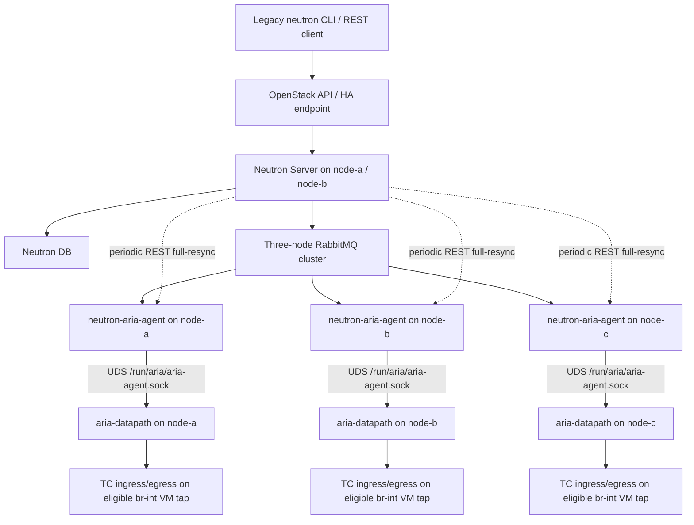

# neutron-aria-agent RC 产品测试计划与详细用例

产品名称：`neutron-aria-agent`。

版本阶段：RC。正式执行时必须在 `CANDIDATE_VERSION` 中填写完整 RC 编号，不能只写
“最新版本”或复用旧现场镜像名称。

状态：RC 候选测试基线。

本文用于 `neutron-aria-agent` RC 的 ACL 功能、兼容性、事务、性能、生命周期、安全和
交付验收。验收对象不是单独的 Python 进程，而是由 Neutron Server `aria_acl` 扩展、
`neutron-aria-agent`、`aria-datapath` 和 TC/eBPF 数据面组成的完整 ACL 链路。
执行结果必须绑定精确源码提交、CI 产物、容器镜像和目标内核，历史证据不能替代当前
候选版本的回归结果。

## 1. 当前开发进度

以下百分比是基于当前代码、自动化门禁和已保存现场证据的工程评估，不是市场发布
承诺：

| 范围 | 进度 | 当前判断 |
| --- | ---: | --- |
| ACL Neutron API/DB/Legacy CLI | 96% | policy、rule、address-set、binding、port-status、RBAC、revision 和 CLI 已形成正式入口 |
| neutron-aria-agent | 94% | Neutron source、full-resync、RPC P2、config-gated P3、状态上报和 stale pending 恢复已具备 |
| aria-datapath ACL/CT | 94% | TC ingress/egress、IPv4/IPv6、WAL、generation/hash、diff apply、恢复和回滚已落地 |
| 事务与生命周期 | 93% | snapshot/delete、进程崩溃、tap recreate、迁移、重启、物理重启和 orphan cleanup 已有证据 |
| 三节点与双栈 | 92% | 已有三计算节点 IPv4/IPv6 ACL RC 证据；IPv6 仍保持显式配置门禁 |
| 容量与性能 | 90% | 1000 条规则和增删单条小于 5 秒目标已有证据；仍需对最终候选版本重跑 |
| 部署、升级与回滚 | 90% | 独立 Kolla 容器、严格健康检查、hash-aware runtime upgrade/rollback 已实现并有现场证据 |
| ACL 可解释性 | 72% | port status、degraded reason 和计数器代码已具备；计数器生产上报仍默认关闭 |
| neutron-aria-agent RC ACL 综合完成度 | 约 93% | 已进入候选测试和发布收口阶段 |
| Aria 全产品规划 | 约 55%-60% | QoS、Mirror、DDoS 和通用 Hook Broker 不属于当前 ACL 交付完成度 |

当前结论：**可以进行正式 ACL 测试**。但必须区分两个对象：

1. 已部署 RC：可以直接执行功能、事务、性能和三节点回归。
2. 当前 `main`：只有在工作树干净、CI 生成精确产物并部署后，才能称为当前源码的
   候选验收；源码比现场镜像新时，旧镜像 PASS 不能自动转移给新提交。

## 2. 测试范围与非范围

### 2.1 本轮范围

- 普通 OVS `normal` VNIC 的 VM tap port；
- `aria_acl` policy、rule、address-set、port/network binding；
- IPv4 ingress/egress ACL；
- 显式启用后的 IPv6/ICMPv6/ND/TCP/UDP ACL；
- stateful/stateless、CIDR、address-set、目的端口和优先级；
- polling full-resync、RPC P2 full-resync、受控 P3 增量回归；
- generation、desired hash、WAL、幂等、失败回滚和重启恢复；
- 1000 条规则、单条增删、持续流量和多 port 更新；
- 三节点、tap recreate、VM migration、主机重启和 Kolla 升级回滚；
- UDS peer credential、socket 权限、状态和可选 counters。

### 2.2 非范围

- SR-IOV VF、LinuxBridge port 和非 OVS normal VNIC；
- Neutron Security Group 兼容或替代；
- Aria QoS、Aria Mirror、DDoS、广播风暴和通用 Hook Broker；
- `default_action=deny`；
- source TCP/UDP port 匹配；
- 把 P3 增量 RPC、IPv6或 counters 自动改成生产默认开启；
- 由 Aria 自动重启、停止或修改 OVS、OVS agent、Nova 或物理主机。

## 3. 测试配置档

| 档位 | 配置 | 发布含义 |
| --- | --- | --- |
| Profile A：ACL Core | IPv4，polling/full-resync，counters 关闭 | RC 最小必测档 |
| Profile B：RPC P2 | `rpc_events_enabled=true`，增量关闭 | 生产候选事件模式 |
| Profile C：IPv6 | `ipv6_acl_enabled=true` | 只有全部 IPv6 用例通过后才能声明双栈 |
| Profile D：Counters | `counters_report_enabled=true` | 受控可解释性 canary，不改变转发语义 |
| Profile E：RPC P3 | RPC、full-resync、incremental 全部开启 | 测试主机专用；通过也不改变默认关闭策略 |

Profile A、B、容量、事务、生命周期和回滚属于 ACL 正式候选的必测项。Profile C、D、
E 是否成为发布阻塞项，由本次版本对外声明决定；只要声明双栈，Profile C 就必须为
阻塞项。

### 3.1 优先级、配置档与执行类别

- `P0`：当前发布声明中的阻断项；失败后不得继续扩大 canary。
- `P1`：重要回归项；允许经过风险评审后延期，但必须记录负责人和补测版本。
- `P2`：实验或受控能力，不作为 RC ACL Core 的发布阻断项。
- `P0/B`、`P0/C`：分别表示在 Profile B、Profile C 被纳入发布声明后，该用例为
  对应配置档的 P0；不是所有发布档位下无条件执行。

每个用例还必须在执行记录中标记以下类别之一：

| 执行类别 | 使用场景 | 限制 |
| --- | --- | --- |
| Field-safe | 正式测试 VM/port 上的 API、流量、同步、迁移和回滚 | 不破坏非测试 port，不重启 OVS/OVS agent |
| Isolated-fixture | crash、Map/CT 写入失败、重复 binding 数据等故障注入 | 只能在隔离 namespace、专用 tap 或维护窗口执行 |
| CI/package | Python 2.7 安装、DB migration、非法对象、mocked transaction | 不以 mock PASS 代替真实 TC/流量证据 |

### 3.2 当前产品状态真值表

测试结果必须按以下当前实现解释，不能套用 Neutron Security Group 的自动绑定语义：

| 输入/运行态 | ACL 状态 | 数据面语义 | 健康语义 |
| --- | --- | --- | --- |
| eligible port，无 enabled binding | `not_requested` / `no_enabled_binding` | bypass | 不因未请求 ACL 而 unhealthy |
| binding disabled | `not_requested` / `no_enabled_binding` | bypass | 正常 |
| binding enabled，policy disabled | `degraded` / `policy_missing_or_disabled` | bypass，不宣称 enforce | 严格健康检查可 unhealthy |
| binding、policy enabled，双向 TC 成功 | `ready` / `applied` | enforce | healthy |
| 仅一个 TC 方向成功或 apply 部分失败 | `degraded` 或 `blocked` | 按失败合同补偿/回滚，不得假 applied | unhealthy |
| IPv6 规则存在但 IPv6 gate 关闭 | `degraded` / `ipv6_acl_disabled` | 不宣称 IPv6 enforce | unhealthy |
| 同目标存在多个 enabled port/network binding | `degraded`，分别报告 `multiple_enabled_port_bindings` 或 `multiple_enabled_network_bindings` | 不选择任意策略偷偷 enforce | unhealthy |
| port status 超过陈旧阈值或身份不匹配 | `stale` / `unknown` | 控制面不得继续显示可靠 applied | unhealthy 或 unknown |

一个 enforced port degraded 时，Aria 严格健康检查可以失败；但独立 OVS canary 必须继续
转发，其他 port 仍按各自 domain 状态工作。健康失败不能被解释为 OVS 业务中断。

## 4. 环境与角色

### 4.1 现场实测拓扑

当前环境不是“一个独立 controller + 三个纯 compute”，而是三节点融合部署：

| 逻辑节点 | 当前 OpenStack/网络角色 | Aria 角色 | 当前测试资源 |
| --- | --- | --- | --- |
| node-a | Neutron Server、Nova 控制服务、DHCP/Metadata、Nova Compute、OVS/LinuxBridge/SR-IOV agents、消息/HA/存储成员 | `neutron-aria-agent` + `aria-datapath` | IPv4 ACL/performance VM；双栈 src/dst VM |
| node-b | Neutron Server、Nova 控制服务、DHCP/Metadata、Nova Compute、OVS/LinuxBridge/SR-IOV agents、消息/HA/存储成员 | `neutron-aria-agent` + `aria-datapath` | IPv4 ACL VM；双栈 src/dst VM |
| node-c | Nova Compute、OVS/LinuxBridge/SR-IOV agents、消息/HA/存储成员；当前不运行 Neutron Server、DHCP/Metadata | `neutron-aria-agent` + `aria-datapath` | IPv4 ACL VM；双栈 src/dst VM |

现场调用和数据路径如下：



三台节点当前都存在 `br-int`、管理/外部接入 bridge 和 mirror bridge。ACL 测试只允许
选择 `br-int` 上的 OVS normal VM tap；不能因为 LinuxBridge/SR-IOV agent 同时存在，
就把相应端口纳入 Aria ACL 验收。

当前测试资源应按以下方式使用：

- node-a、node-b、node-c 各保留至少一个可登录的 IPv4 ACL VM；
- 三台节点各保留一对双栈 src/dst VM，用于 same-node 和 cross-node IPv6 测试；
- node-a 的独立 performance VM 用于 1000 条规则和 active traffic，避免与普通功能
  用例争用同一 port；
- 所有固定名称、UUID、IP 和宿主机映射在执行前动态查询并写入私有 evidence，不能
  仅凭 VM 名称推断实际 host；
- 准备一条不使用被测 port 的独立 OVS 连通性 canary。

### 4.2 现场当前 Aria 配置档

现场三台节点在本次复核时配置一致：

| 配置 | 当前值 | 测试含义 |
| --- | --- | --- |
| `managed_domains` | `acl` | 仅 ACL 由 Neutron 托管 |
| `full_resync_enabled` | `true` | 周期 REST 对账开启 |
| `resync_interval` | `60` 秒 | polling 收敛预算必须基于该值计算 |
| `rpc_events_enabled` | `true` | 当前运行态是 RPC P2，不是 polling-only |
| `incremental_rpc_enabled` | `false` | 事件触发 authoritative full-resync，不启用 P3 scoped apply |
| `ipv6_acl_enabled` | `true` | 当前现场已经进入双栈测试档 |

这张表描述现场当前值，不替代发行包默认值检查。完整 RC 必须先记录当前配置，再按
SYNC-001/SYNC-009 临时回到 polling-only 建立基线，随后恢复 RPC P2；测试结束恢复到
批准的现场配置，不能假设“配置文件默认值”等于“现场正在运行的值”。

现场的 `neutron-aria-agent` 和 `aria-datapath` 镜像均使用 RC 标签，三节点六个 Aria
容器当前均为 healthy。复核同时发现 node-c 的 RabbitMQ Docker health 与
`rabbitmqctl cluster_status` 结果不一致：容器标记异常，但集群显示三节点 running、
无 alarm、无 network partition。该差异不代表 RPC 已失败，但在执行 Profile B 前必须
查明 healthcheck 原因并形成证据，不能只取对验收有利的一侧结果。

### 4.3 测试变量

执行前填写，不把真实凭据写入测试文档或证据仓库：

```text
CANDIDATE_SHA=
CANDIDATE_VERSION=
CI_RUN_ID=
DATAPATH_IMAGE=
DATAPATH_IMAGE_ID=
ARIA_AGENT_SHA256=
EBPF_SHA256=
KERNEL_RELEASE=

PROJECT_ID=
NETWORK_ID=
PORT_A_ID=
PORT_B_ID=
PORT_C_ID=
PORT_A_IFNAME=
PORT_B_IFNAME=
PORT_C_IFNAME=
VM_A_IPV4=
VM_B_IPV4=
VM_C_IPV4=
VM_A_IPV6=
VM_B_IPV6=
VM_C_IPV6=
```

## 5. 结果与证据规则

每个用例只能使用以下结果：

| 结果 | 含义 |
| --- | --- |
| PASS | 所有预期满足，清理完成，证据齐全 |
| FAIL | 产品行为与预期不一致，或清理失败 |
| BLOCKED | 环境前置条件不满足，未执行到产品判断点 |
| NOT_APPLICABLE | 当前发布档明确不包含该能力，必须写明批准依据 |

不允许把以下情况记录为 PASS：

- 只通过 CI、没有目标 4.18 内核 verifier/真实流量证据；
- UDS 请求超时后没有继续确认最终 generation/hash；
- ACL 规则创建成功但 port status 没有收敛到预期状态；
- 流量结果正确但测试对象、方向或宿主机不确定；
- 临时 policy/rule/binding、TC filter、Map 或测试 VM 没有清理；
- 测试触发了未授权的 OVS/OVS-agent 重启；
- 用历史候选产物代替当前候选产物。

每个用例至少保存：

```text
case.json               用例 ID、候选身份、开始/结束时间、结果
commands.log            命令和返回码，敏感值脱敏
neutron-before.txt      Neutron 对象和 port status 基线
neutron-after.txt       应用后的对象和 port status
datapath-before.json    UDS status/readiness 基线
datapath-after.json     accepted/applied/pending/hash/WAL 结果
traffic.log             带时间戳和 nonce 的流量结果
aria-agent.log          测试时间窗内 Python 日志
aria-datapath.log       测试时间窗内 Rust 日志
ovs-identity.txt        OVS PID、OVS-agent container/start identity
cleanup.txt             临时对象和本机残留检查
```

## 6. 进入条件

开始候选验收前必须满足：

1. 当前分支为 `main`，工作树干净，候选提交已推送。
2. CI 对精确提交完成 Rust、eBPF、Python 2.7 包、DB、CLI 和发布包门禁。
3. 下载的 artifact manifest、checksum 与候选提交一致。
4. 所有计算节点使用同一候选 image digest 和同一 eBPF/userspace hash。
5. 目标内核版本、BPF JIT、bpffs、TC/TCX attach 后端已记录。
6. `aria_acl` extension 可见，DB migration 状态正确。
7. 三个 `neutron-aria-agent` heartbeat alive；三台节点上的 3 个
   `neutron-aria-agent` 容器和 3 个 `aria-datapath` 容器全部健康。
8. 无 `pending_generation`，`accepted_generation == applied_generation`。
9. 测试 port 的 `binding:vif_type=ovs`、`binding:vnic_type=normal`，tap 在
   `br-int` 且 `external_ids:iface-id` 与 port UUID 匹配。
10. OVS 和 OVS-agent 身份、VM 基线流量、现有 ACL 对象已备份。
11. 所有测试对象使用唯一前缀，退出 trap 能按 binding、rule、address-set、policy
    的安全顺序清理。
12. 回滚镜像、配置和 DB 备份可用。

## 7. 公共检查命令

以下命令使用 Legacy Neutron CLI；具体容器和 `adminrc` 路径按部署环境调整。

```bash
neutron ext-show aria_acl
neutron agent-list
neutron aria-acl-policy-list
neutron aria-acl-rule-list
neutron aria-acl-address-set-list
neutron aria-acl-binding-list
neutron aria-acl-port-status-list
```

创建一个最小 IPv4 ingress ICMP drop 策略：

```bash
POLICY_ID=$(neutron aria-acl-policy-create \
  --name acl-test-ingress-icmp \
  --default-action allow --stateful true --enabled true \
  -f value -c id)

RULE_ID=$(neutron aria-acl-rule-create \
  --policy "${POLICY_ID}" --direction ingress --priority 100 \
  --action drop --ethertype IPv4 --protocol icmp --enabled true \
  -f value -c id)

BINDING_ID=$(neutron aria-acl-binding-create \
  --policy "${POLICY_ID}" --port "${PORT_A_ID}" --enabled true \
  -f value -c id)

neutron aria-acl-policy-show "${POLICY_ID}" --with-rules
neutron aria-acl-port-status-list --port "${PORT_A_ID}"
```

清理必须先删除 binding，再删除 rule，最后删除 policy：

```bash
neutron aria-acl-binding-delete "${BINDING_ID}"
neutron aria-acl-rule-delete "${RULE_ID}"
neutron aria-acl-policy-delete "${POLICY_ID}"
```

## 8. 测试用例总表

### 8.1 候选身份、部署与基线

| ID | 优先级 | 测试步骤 | 预期结果 | 自动化/证据 |
| --- | --- | --- | --- | --- |
| PRE-001 精确候选身份 | P0 | 比较源码 SHA、CI run、bundle manifest、image ID、userspace/eBPF hash 和三节点文件 hash | 所有身份指向同一候选；任何不一致立即 BLOCKED | release manifest、checksum、三节点 hash |
| PRE-002 旧内核 verifier | P0 | 在目标 4.18 内核运行 TC ingress/egress isolated canary | 两个方向加载成功；linked stack 不超过当前 480-byte gate；清理完整 | `neutron_aria_legacy_kernel_loader_canary.sh` |
| PRE-003 容器部署 | P0 | 依次检查/安装 datapath 和 Python agent 镜像 | 独立容器启动，挂载和权限符合设计，均为 healthy | `aria_datapath_container_smoke.sh`、`neutron_aria_container_smoke.sh` |
| PRE-004 Neutron 插件与 DB | P0 | 检查 extension、service plugin、表结构和 migration head | `aria_acl` 可见，DB schema 正确，重复 check 幂等 | `neutron_aria_acl_plugin_load_smoke.sh`、DB migration smoke |
| PRE-005 OVS 基线 | P0 | 记录 OVS PID、OVS-agent container/start time、bridge/tap/ofport 和 canary | 基线稳定；Aria 安装不改变 `binding:vif_type`，不重启 OVS | `ovs-identity.txt`、持续 canary |
| PRE-006 XDP 中立 | P0 | 记录测试 port 的 XDP/TC attach；分别验证 XDP 未启用和启用中立程序时的 ACL | ACL 权威点始终是 TC ingress/egress；XDP 不产生 ACL/CT verdict，不覆盖同接口其他合法程序 | hook inventory、TC authority smoke |
| PRE-007 Python 2.7 离线安装 | P0 | 在无外网、无旧 egg/cache 的干净目标镜像安装正式 bundle 并启动插件/agent/CLI | 依赖完整；导入、entry point、CLI、heartbeat 均成功；不依赖构建机残留 | offline package/image import smoke |
| PRE-008 DB 升级兼容 | P0 | 从带历史对象的上一受支持 schema 升级到 migration head；重复执行；按正式 runbook 回退 | 数据和 revision 保留；升级幂等；失败不会留下半 schema；回退行为与文档一致 | DB migration/rollback smoke |
| PRE-009 RabbitMQ RPC 基线 | P0/B | 比较三节点容器 health、`rabbitmqctl cluster_status`、alarm、partition 和 AMQP listener | 三节点均 running，无 alarm/partition；容器 health 与集群状态一致，或已有批准的根因和风险结论 | RabbitMQ preflight evidence |

### 8.2 API、DB 与 Legacy CLI

| ID | 优先级 | 测试步骤 | 预期结果 | 自动化/证据 |
| --- | --- | --- | --- | --- |
| API-001 Policy CRUD | P0 | create/show/update/list/delete；每次读取 revision | 字段正确；实际修改使 revision 单调递增；重复读取不递增 | DB CRUD smoke |
| API-002 Policy with-rules | P1 | 建立多个 ingress/egress、不同 priority 规则，执行 `policy-show --with-rules` | 输出 `rule_count`；rule ID 按 ingress/egress、priority、ID 排序，每行一个 | CLI consistency smoke |
| API-003 IPv4 Rule CRUD | P0 | 覆盖 any/ICMP/TCP/UDP、CIDR、单端口、端口范围、allow/drop | REST/CLI/DB 字段一致；更新 revision 正确 | DB CRUD、CLI consistency |
| API-004 IPv6 Rule CRUD | P1/C | 创建 IPv6、ICMPv6、IPv6 CIDR 和 address-set 规则 | family、protocol、CIDR 一致；IPv4/IPv6 混用被拒绝 | dual-stack CLI/API smoke |
| API-005 Address-set | P0 | create/show/update/list/delete；成员去重/规范化；空集合；IPv4/IPv6 集合 | CIDR canonical；混合 family 拒绝；引用关系受保护 | DB CRUD smoke |
| API-006 Binding CRUD | P0 | 分别创建 port/network binding；disable/enable；查询过滤 | target_type/target_id 正确；disabled binding 等价于无 enabled binding，不产生 enforce | port projection smoke |
| API-007 非法语义 | P0 | 尝试 `default_action=deny`、source port、反向端口范围、错误协议、family mismatch、跨 project 引用 | 请求以稳定 4xx/错误原因失败；DB 无半对象；不发送虚假已应用状态 | contract tests、RBAC smoke |
| API-008 删除原子性 | P0 | 删除仍被 rule/binding 引用的对象；注入 DB 失败 | 关联数据保持一致；无通知先于 commit；重试可成功 | policy rollback、DB transaction tests |
| API-009 RBAC/Project 隔离 | P0 | tenant A/B 分别读写对象，admin 跨 project 查询 | tenant 不能读写他人对象；admin 行为符合 policy | `neutron_aria_acl_rbac_smoke.sh` |
| API-010 Pagination/Query | P1 | forward/reverse/custom marker、带/不带 address-set members 的分页 | 无重复/遗漏；SQL query 保持已有预算，无 N+1 | pagination/query field gate |
| API-011 Network binding 展开 | P0 | network 绑定 policy；网络内放置 eligible VM port、DHCP/service port 和 foreign-host port | 仅本 host eligible VM port 被展开；服务口和 foreign-host port 不接管 | projection/full-resync smoke |
| API-012 Port 覆盖 Network | P0 | 同一 eligible port 同时命中 network binding 和显式 port binding | 显式 port binding 胜出；删除后恢复 network policy；全程状态和 policy ID 可解释 | projection + active traffic |
| API-013 Binding 冲突防御 | P0 | 通过隔离 DB fixture 构造同一目标多个 enabled port/network binding | agent 稳定 degraded 并报告精确 reason，不随机选 policy，不污染其他 port | Isolated-fixture contract test |
| API-014 Policy/Binding 启停矩阵 | P0 | 逐一组合 policy enabled/disabled 与 binding enabled/disabled | 结果严格符合 3.2 真值表；重复切换幂等；旧 ACL 无残留 | status + active traffic |
| API-015 Security Group 独立性 | P0 | 在 Security Group 关闭的环境创建、更新、删除 Aria ACL，并比较 Neutron port 前后字段 | 不读写 `security_groups`、`port_security_enabled`、allowed-address-pairs 或 VIF/VNIC binding；无需开启 SG | port/API/DB diff |
| API-016 Priority/family 约束 | P0 | 对同一 policy 创建同方向、相同 priority 的 IPv4 与 IPv6 enabled rule；再创建同 family 重复 rule | 跨 family 两条规则均创建并收敛为 ready；同 family 重复写返回冲突，防御性 effective ACL 报告含 family 的 `duplicate_acl_priority` | contract/API/DB/status smoke |
| API-017 裸 host 规范化 | P0 | 分别用裸 IPv4、裸 IPv6 创建 rule CIDR 与 address-set member，并与等价显式 host prefix 混用 | show/DB/source 均返回 IPv4 `/32`、IPv6 `/128`；address-set 规范化后去重；非法拼写仍拒绝 | contract/API/CLI/DB smoke |

### 8.3 Port 发现、资格和接管

| ID | 优先级 | 测试步骤 | 预期结果 | 自动化/证据 |
| --- | --- | --- | --- | --- |
| PORT-001 OVS tap eligible | P0 | 对 normal OVS VM port 执行 full-resync | 仅本 host port 被映射到正确 tap/ifindex，TC ingress/egress 属于 Aria | full-resync smoke |
| PORT-002 服务口不接管 | P0 | 枚举 DHCP、metadata、router/service、LinuxBridge、SR-IOV 和无 `br-int` membership 的 port | 全部 ignored/ineligible；不 attach、不创建 ACL Map 状态 | boundary smoke |
| PORT-003 无 binding | P0 | eligible port 不创建 Aria binding | port 可被发现，但 ACL 为 `not_requested/bypass`，OVS 流量不受影响 | port-status、baseline traffic |
| PORT-004 iface-id 防误绑 | P0 | 构造 ifname 相似但 `external_ids:iface-id` 不匹配的测试接口 | 不认领错误接口，报告 identity mismatch/ineligible | OVS membership gate |
| PORT-005 ACL 管理权 | P0 | 配置 `managed_domains=["acl"]`，对已接管 port 尝试本地 ACL 写入 | 本地 ACL 写被稳定拒绝；Neutron snapshot 仍可应用；拒绝不修改现有数据面 | domain authority smoke |
| PORT-006 非托管模块兼容观察 | P2 | 在隔离 port 上仅托管 ACL，抽样执行已存在的本地 Trace/TCP 等非托管命令 | 非托管模块按自身权限合同工作且不改写 ACL；QoS/Mirror 仅观察，不据此声明产品化 | compatibility record |

### 8.4 IPv4 ACL 真实流量

| ID | 优先级 | 测试步骤 | 预期结果 | 自动化/证据 |
| --- | --- | --- | --- | --- |
| ACL4-001 ingress ICMP | P0 | 基线 ping；创建 ingress ICMP drop 并绑定；等待收敛；删除 | 基线通，enforce 后阻断，删除后恢复 | live downlink/active traffic smoke |
| ACL4-002 egress ICMP | P0 | 从 VM 内发起带 nonce 的 ping；创建 egress ICMP drop | VM 发起流量阻断；回滚恢复；不能仅用 host->VM 代替 | live egress smoke |
| ACL4-003 TCP 单端口 | P0 | VM 启动 nonce echo；仅 drop 一个目的端口，同时探测另一端口 | 命中端口阻断，非命中端口通过 | active matrix case |
| ACL4-004 UDP 范围 | P0 | 配置目的端口范围，测试范围内、边界和范围外端口 | 范围内及边界匹配，范围外通过 | active matrix case |
| ACL4-005 CIDR | P0 | 分别配置 src/dst CIDR 的匹配和非匹配流量 | 仅匹配地址集的流量执行规则 | active matrix case |
| ACL4-006 Address-set 更新 | P0 | 规则引用 address-set；增加、替换、删除成员 | 生效随成员变化收敛；不存在旧成员残留 | source/full-resync、traffic log |
| ACL4-007 Priority | P0 | 创建重叠 allow/drop 规则，交换 priority | 最小优先级规则决定结果；更新期间不出现整 port bypass | active traffic + status |
| ACL4-008 Stateful reply | P0 | stateful policy 允许首包，验证反向回复；再创建反向 drop | 已建立连接按合同处理；策略 revision 更新使旧 CT 失效 | active matrix |
| ACL4-009 Stateless | P1 | `stateful=false` 重复 ACL4-003/004 | 两个方向分别按规则判断，不错误复用 CT allow | active matrix |
| ACL4-010 ARP/基础二层 | P0 | 在 ACL apply/rollback 前后清邻居并触发 ARP | IPv4 ACL 不破坏产品合同允许的 ARP/基础 L2；OVS 基线持续 | tcpdump/neighbor/traffic log |
| ACL4-011 Fragment | P1 | 首片/后续片、乱序、重叠、过期、不同 tap/VLAN | 符合 fragment authority 和 fail-safe 合同；无跨 tap/VLAN 污染 | fragment field driver |
| ACL4-012 非 IP 二层透传 | P0 | 产生 ARP、广播、多播和隔离环境内的未知 EtherType | 当前 ACL 不把非 IP 帧误判为 IP ACL 命中；按 TC 中立合同透传，计数/状态不伪报 ACL verdict | packet capture + nonce frames |
| ACL4-013 Selector/Group 隔离 | P0 | 两个 port 使用重叠 CIDR、相同规则内容和不同 policy；再更新其中一方 | selector/group 所有权按 port/policy 隔离；无论内部是否复用内容，都不能串改或误删 | overlap regression + traffic |
| ACL4-014 Disabled rule | P0 | 在 ready policy 中启停一条 drop rule，并保持其他规则不变 | disabled rule 不进入 effective ACL；再次启用后恢复；未变规则不被重写或误删 | status/profile/traffic |

### 8.5 IPv6 ACL 真实流量

| ID | 优先级 | 测试步骤 | 预期结果 | 自动化/证据 |
| --- | --- | --- | --- | --- |
| ACL6-001 默认关闭 | P0 | 保持 `ipv6_acl_enabled=false`，创建 IPv6 policy/binding | API 可保存合法对象，但 agent 不宣称 enforce；状态为稳定 unsupported/degraded/bypass 原因 | status/log |
| ACL6-002 ICMPv6 ingress/egress | P0/C | 启用 IPv6 gate，分别执行两个方向的 echo allow/drop | 方向正确，阻断和恢复可重复 | dual-stack ACL smoke |
| ACL6-003 ND 显式语义 | P0/C | 清邻居；显式 allow ICMPv6 后探测；再配置 deny-any | allow 时 NS/NA 和 echo 完成；deny-any 可阻断 ND；无隐藏 ND bypass | ND smoke、neighbor state |
| ACL6-004 TCP/UDP | P0/C | same-compute 和 cross-compute 分别测试单端口/范围 | 目的端口、方向、CIDR 和回滚正确 | IPv6 transport probes |
| ACL6-005 Stateful | P0/C | 建立 IPv6 会话，修改 policy revision，验证 CT invalidation | 回复路径和 revision 失效语义正确 | stateful dual-stack log |
| ACL6-006 Fragment/扩展头 | P1/C | IPv6 fragments、扩展头、畸形链和不同 tap 隔离 | parser/verifier 安全；合同内流量正确；畸形流量有稳定 reason | IPv6 probe tools/fragment driver |
| ACL6-007 Same-port dual-stack | P1/C | 同一个 Neutron port 同时配置 IPv4/IPv6 规则并产生双栈流量 | family key 隔离，不发生 IPv4/IPv6 group 或 CT 互串 | combined traffic/status |

### 8.6 同步、RPC 和状态上报

| ID | 优先级 | 测试步骤 | 预期结果 | 自动化/证据 |
| --- | --- | --- | --- | --- |
| SYNC-001 Polling full-resync | P0 | RPC 关闭，创建/更新/删除 ACL 对象 | 周期 full-resync 最终收敛；无重复 generation 放大 | full-resync smoke |
| SYNC-002 RPC P2 fanout | P0/B | 单节点、双节点、三节点启用 RPC；发送真实对象事件 | 本地 host 触发 full-resync，跨节点 fanout 稳定 | RPC fanout smoke |
| SYNC-003 Foreign-host filter | P0/B | 更新不属于当前 host 的 port | 当前 host 不接管或错误 apply foreign port | RPC foreign-host smoke |
| SYNC-004 Source cleanup | P0/B | 迁移/rebind/delete 后观察旧 host | 旧 host 清理，目标 host 从 authoritative source 应用 | RPC source-cleanup smoke |
| SYNC-005 Event loss fallback | P0/B | 人为跳过一个事件或制造 queue overflow，然后等待周期对账 | full-resync 修复最终状态；不能永久静默漂移 | event merge/full-resync evidence |
| SYNC-006 P3 default-off | P0 | 检查 packaged config 和 heartbeat | `incremental_rpc_enabled=false`，生产默认仍是 P2/polling | config/heartbeat |
| SYNC-007 P3 controlled canary | P2/E | 仅测试 host 开启 P3，执行 port-local update/delete/foreign event | 安全事件走 port-scoped apply；不可信 revision 回退 full-resync；可回滚到 P2 | P3 acceptance smoke |
| SYNC-008 Heartbeat V2 summary | P0 | 三节点执行 `neutron agent-show` 和 dedicated port-status API | heartbeat 为 summary，大小不随 port 数线性膨胀；详细 port 状态从专用 API 查询 | heartbeat V2 smoke |
| SYNC-009 RPC 模式切换 | P0/B | 先以 RPC 关闭完成 polling 基线，再单节点、双节点、三节点开启 P2，最后回退 polling | heartbeat `sync_mode` 与配置一致；切换不丢策略、不重复接管；回退后周期对账仍可修复漂移 | staged RPC canary |
| SYNC-010 收敛预算 | P0 | 分别记录 polling 与 P2 的 API commit、agent observe、accepted、applied、traffic 生效时间 | polling 在 `2 * resync_interval + apply budget` 内收敛；P2 应早于下一轮 polling；超预算不得假 PASS | timestamped convergence report |

### 8.7 事务、幂等和故障恢复

| ID | 优先级 | 测试步骤 | 预期结果 | 自动化/证据 |
| --- | --- | --- | --- | --- |
| TXN-001 相同 hash 重试 | P0 | 连续提交相同 generation/hash 或相同 desired state | 返回已收敛/观察中，不重复 purge/rewrite，不生成无意义新 generation | UDS profile log |
| TXN-002 UDS accepted/pending | P0 | 让 apply 超过客户端短等待窗口 | 请求 accepted 后通过 status 收敛；Python 不重复洪泛 snapshot | timeout convergence smoke |
| TXN-003 旧 generation | P0 | 在新 generation commit 后提交旧 generation | 明确拒绝 stale，已应用状态不回退 | transaction tests |
| TXN-004 Snapshot crash | P0 | 在 intent 后、attach 后、ACL apply 后、commit 前分别 kill datapath | 重启后 replay 为 recovered/blocked/degraded；未验证状态绝不 ready | crash injection smoke |
| TXN-005 Delete crash | P0 | delete intent、detach、purge、commit 各切点 kill | 重启后保留正确 pending delete 或完成清理；不会假 applied | delete fault-injection smoke |
| TXN-006 Python pending recovery | P0 | 注入 stale `pending_generation/hash` 后重启 Python agent | 查询远端状态后 commit/clear 或触发 full-resync；hash mismatch 阻断并告警 | transaction-state smoke |
| TXN-007 Per-port 故障隔离 | P0 | 一个 port 制造 apply 失败，另一个 port 下发正常 ACL | 失败 port degraded/bypass；正常 port ready/enforce，不拖垮整批 | ACL fault-injection smoke |
| TXN-008 WAL/状态一致性 | P0 | commit 后重启并比较 WAL status hash、runtime inventory、port status | commit hash 一致；无 pending/replay failure/order drift | status/WAL evidence |
| TXN-009 Rollback 失败 | P1 | isolated fixture 注入 Map/CT compensation 失败 | 进入 blocked/recovery-required；不伪装成功；后续修复可重试 | fault fixture |
| TXN-010 双方向补偿 | P0 | ingress 成功后注入 egress apply 失败，再交换失败方向 | 已成功方向按合同回滚/恢复到完整旧代；不得只留下单方向新策略并显示 applied | multi-direction compensation smoke |

### 8.8 生命周期与运维

| ID | 优先级 | 测试步骤 | 预期结果 | 自动化/证据 |
| --- | --- | --- | --- | --- |
| LIFE-001 Python agent restart | P0 | ACL enforce 时重启 `neutron-aria-agent` | 数据面保持已提交 ACL；恢复后 generation 对齐；OVS canary 无间断 | runtime stability smoke |
| LIFE-002 Datapath restart | P0 | ACL enforce 时重启 `aria-datapath` | 按可用性优先合同恢复；恢复窗口状态诚实；OVS forwarding 不被阻断 | crash/restart smoke |
| LIFE-003 Tap recreate | P0 | 在隔离测试 VM 上触发 tap 销毁/重建 | 不信任旧 ifindex；清旧状态并重新 attach；记录实际恢复时间 | tap recreate smoke |
| LIFE-004 VM migration | P0 | 将测试 VM 从 node-a 迁移到 node-b，再覆盖 node-c | 源节点清理，目标节点在 binding 生效后接管；无双 host enforce 残留 | VM migration smoke |
| LIFE-005 Port delete | P0 | 删除有 ACL 的测试 port | binding/status/runtime/TC/Map 清理；重试幂等；其他 port 不受影响 | delete/cleanup smoke |
| LIFE-006 Compute reboot | P0 | 在维护窗口重启一个测试计算节点 | 容器恢复、WAL replay、full-resync 和 ACL 重新收敛；OVS 由自身机制恢复 | physical reboot runbook |
| LIFE-007 OVS 外部维护 | P1 | 仅由测试 harness 显式重启 OVS 组件，Aria 只观察 | Aria 不自行重启 OVS；按 tap 是否变化选择保持/reattach/full-resync | OVS restart smoke |
| LIFE-008 Runtime upgrade | P0 | 同 hash 快速升级；再执行 forced/hash-changing migration 流程 | writer quiesce、精确 detach、zero-port barrier、候选启动、full-resync、ready | Kolla safe-upgrade installer |
| LIFE-009 Runtime rollback | P0 | 从候选反向恢复上一镜像 | 先 detach 候选，再恢复旧 state/pins/container；无残留 quarantine/pending | installer rollback/check |

### 8.9 容量、性能和稳定性

| ID | 优先级 | 测试步骤 | 预期结果 | 自动化/证据 |
| --- | --- | --- | --- | --- |
| PERF-001 1000 条初始下发 | P0 | 一个 port 创建 1000 条有效规则，测 API 创建、snapshot build、UDS、datapath apply 和总收敛 | 接受 1000 条；datapath apply 和总收敛无超时洪泛；记录各阶段时间 | 1000-rule gate |
| PERF-002 增加 1 条 | P0 | 在 1000 条基础上新增一条规则 | 只应用 delta；总收敛小于 5 秒；未变 port 完全跳过 | profile log |
| PERF-003 删除 1 条 | P0 | 删除一条规则 | 只删除对应 group/policy delta；总收敛小于 5 秒 | profile log |
| PERF-004 1001 限额 | P0 | 尝试形成 1001 条 effective rules | 稳定拒绝/degraded 原因为 `acl_rule_limit_exceeded:1001:1000`；原 1000 条保持 | limit gate |
| PERF-005 Active traffic | P0 | 1000 条下持续高频 ICMP/TCP/UDP，执行增删单条和复杂更新 | 非空 diff 不出现整 port bypass；报文只看到合同允许的旧/新状态 | marked nonce traffic |
| PERF-006 多 port burst | P1 | 三个 port 同时多轮 create/update/delete | 事件合并，无 resync amplification；一个 generation/burst 的合同满足 | bulk coalescing smoke |
| PERF-007 30 分钟 soak | P0/B | 三节点 RPC P2、持续流量、周期 ACL 变更、状态采样 | 无 pending、generation drift、容器重启、内存持续增长和 OVS gap | RPC soak/runtime soak |
| PERF-008 资源压力 | P1 | 达到 Map/CT/fragment/event 容量边界 | 有稳定压力/丢失计数；不 panic；超限按合同 fail-safe/degraded | capacity counters/log |
| PERF-009 Selector 成员限额 | P0 | address-set 分别形成 2048 和 2049 个有效成员并被规则引用 | 2048 可收敛；2049 稳定 degraded，reason 包含 `acl_selector_member_limit_exceeded`；原提交态不被半覆盖 | selector limit gate |

### 8.10 安全、可观测和清理

| ID | 优先级 | 测试步骤 | 预期结果 | 自动化/证据 |
| --- | --- | --- | --- | --- |
| SEC-001 Socket 权限 | P0 | 检查 `/run/aria` 和 UDS owner/group/mode | 非 world-writable；只授权 Python agent 身份 | UDS hardening smoke |
| SEC-002 Peer credential | P0 | 授权 agent 和未授权本机 client 分别访问 UDS | 授权成功；未授权拒绝并审计；不改变数据面 | peercred profile smoke |
| SEC-003 日志脱敏 | P0 | 触发 API/UDS/Neutron 错误并扫描日志/evidence | 无密码、token、内部发布标识和完整敏感 payload | log redaction/public scan |
| OBS-001 Readiness | P0 | 正常、pending、degraded、blocked、not-requested 分别查询 status/readyz/healthcheck | 正常为 ready/healthy；非收敛状态返回非 ready，不假健康 | composite readiness smoke |
| OBS-002 Port counters | P1/D | 开启 counters，产生 allow/drop 流量，执行 `port-status-show --counters` | packets/bytes/drop/pps/bps 单调合理；删除对象后按合同清理 | counter sampler/CLI smoke |
| OBS-003 Drop reason | P1/D | 产生 ACL deny、fragment 和 malformed 测试流量 | reason ID/名称稳定，UNKNOWN 保留数字，不改变 verdict | drop-reason dictionary gate |
| OBS-004 Status 陈旧与身份 | P0 | 停止上报超过阈值；构造旧 host、旧 generation、错误 policy/binding identity | 控制面投影为 `stale/unknown` 或 `projection_unavailable`，不会继续显示可靠 applied；恢复后重新收敛 | projection/status smoke |
| CLEAN-001 对象清理 | P0 | 每组测试结束列出测试前缀对象 | policy/rule/address-set/binding 全部为零；原有对象未改变 | cleanup.txt |
| CLEAN-002 Runtime 清理 | P0 | 检查 deleted port 的 TC、Map、pin、WAL、status、orphan marker | 无目标残留；sibling port/program 保持；失败可重试 | orphan scrub smoke |
| CLEAN-003 最终基线 | P0 | 恢复默认配置，检查三节点 heartbeat、readiness、generation 和 VM/OVS canary | 全部无 pending；目标 port `not_requested/bypass`；业务基线恢复 | final-state summary |

## 9. 高风险用例执行细则

### 9.1 ACL4-001：IPv4 ingress drop 与回滚

前置条件：目标 port 基线 ping 连续成功，port status 为 `not_requested/bypass`。

步骤：

1. 启动带时间戳的持续 ping，至少记录 10 个成功回复。
2. 创建唯一前缀的 policy、ingress ICMP drop rule、port binding。
3. 记录对象 UUID、revision 和创建时间。
4. 等待 port status 同时满足：目标 policy/binding ID、`ready`、
   `effective_action=enforce`、generation 已提交且没有 pending。
5. 继续观察至少 5 个探测周期，要求没有成功回复。
6. 删除 binding/rule/policy，等待 status 回到 `not_requested/bypass`。
7. 要求至少恢复 10 个连续成功回复。
8. 检查 OVS/OVS-agent 身份未变，临时对象和 datapath policy 已清理。

失败条件：仅规则创建成功但 status 未收敛；阻断方向错误；删除后未恢复；测试期间
OVS 身份变化；cleanup 不完整。

### 9.2 ACL4-002：VM 主动 egress

1. 使用 guest exec/SSH 在 VM 内启动带随机 nonce 的 ICMP/TCP/UDP 请求。
2. 宿主机只负责控制和收集结果，不得用 host-to-VM 流量替代 egress 证据。
3. 创建 egress 规则并等待 `ready/enforce`。
4. 验证 VM 发起的命中流量失败，非命中流量继续成功。
5. rollback 后验证同一 nonce 流恢复。

关键证据：guest 命令返回、服务端 nonce、方向、五元组、policy/rule/binding ID。

### 9.3 SYNC-001/SYNC-009：Polling 基线到 RPC P2

RPC 验收不得直接从开启状态开始，必须使用同一候选、同一测试 port 和同一流量矩阵
完成以下顺序：

1. 三节点设置 `rpc_events_enabled=false`、`incremental_rpc_enabled=false`，确认
   heartbeat `sync_mode=polling_full_resync`。
2. 创建、更新、删除 ACL，记录 API commit 到 applied/traffic 生效时间；必须在
   `2 * resync_interval + apply budget` 内收敛。
3. 仅 node-a 开启 `rpc_events_enabled=true`，保持 incremental 关闭，确认
   `sync_mode=rpc_full_resync`，重跑本地事件、foreign-host 和 cleanup。
4. 扩大到 node-a+node-b，再扩大到三节点，验证 fanout 不产生跨 host 误接管。
5. 制造可控事件丢失/overflow，确认周期 full-resync 最终修复，而不是永久漂移。
6. 三节点回退 `rpc_events_enabled=false`，再次创建/删除策略，确认 polling 仍可收敛。
7. 最后恢复候选默认配置，清除 pending，保存各阶段 heartbeat、event batch、generation
   和流量证据。

P2 的事件收敛必须早于下一轮 polling；测试报告记录实际分位值和最大值。若事件模式
失败但 polling 最终修复，该 P2 用例仍为 FAIL，不能用“最终一致”掩盖 RPC 缺陷。

### 9.4 TXN-002：长耗时 apply 不重复提交

1. 使用大规则集让 datapath apply 超过客户端快速返回窗口。
2. Python 记录 Neutron read、snapshot build、UDS submit 和 status poll 时间。
3. Rust 记录 apply start、对象数、diff、Map update、WAL 和 apply done 时间。
4. 在 apply 期间连续采样 status。
5. 检查同一 desired hash 只有一个有效 apply，没有 generation 队列放大。
6. 最终 `accepted_generation == applied_generation`，pending 清空。

失败条件：客户端 timeout 后不停 bump generation；同 hash 重复 purge/rewrite；最终
状态不收敛或错误进入 ready。

### 9.5 TXN-004：Datapath crash injection

每个 fault point 单独执行，不串用上一次未清理状态：

```text
after_intent_fsync
after_attach_before_apply
after_acl_partial_stage
after_apply_before_commit
after_commit_before_response
```

每次步骤：提交策略、等待 fault point、kill 进程、保存 WAL/pin/Map/TC、重启、查询
status、执行 recover/full-resync、验证流量和 cleanup。重启后的第一状态不能在身份未
对账时报告 ready。

### 9.6 LIFE-004：VM migration

1. 记录源 host 的 port binding、tap/ifindex、TC、Map 和 status。
2. 在 ACL enforce 和持续流量下迁移测试 VM。
3. 记录 Neutron `binding:host_id` 切换时间。
4. 源 host 必须删除旧 port runtime，目标 host 只能在 authoritative binding 生效后
   创建新 runtime。
5. 验证目标 VM ACL 继续符合策略，回滚后流量恢复。
6. 两端检查无双重 attachment、旧 ifindex、stale pin 或 orphan map。

### 9.7 PERF-001 至 PERF-005：1000 条规则

必须分开测量：

```text
API object creation time
Neutron read time
snapshot build time
UDS accepted time
datapath queue wait time
group/map diff time
policy diff time
WAL commit time
end-to-end convergence time
```

通过标准：

- 1000 条有效规则可以收敛；
- 增加或删除一条规则端到端小于 5 秒；
- 未变化 port 不重写 ACL；
- `disable_ms=0` 用于非空 diff；
- active traffic 不出现整 port bypass；
- 1001 条以稳定容量原因拒绝，不破坏已提交 1000 条；
- cleanup 后 status、Map 和流量回到基线。

### 9.8 LIFE-008/LIFE-009：安全升级与回滚

升级：

```text
preflight
  -> stop Python writer
  -> exact UDS delete of managed ports
  -> require managed_ports=0
  -> preserve old state/pins/container
  -> start candidate
  -> start Python writer
  -> authoritative full-resync
  -> verify hashes/readiness/generation/OVS identity
```

回滚使用相同边界反向执行，不能仅重命名旧容器覆盖候选 live pins。任一步失败都要
保留 release ledger；自动恢复失败时保持 Python writer 停止并报告人工恢复步骤。

## 10. 执行顺序

推荐顺序：

```text
Day 0
  exact candidate + offline install/migration + XDP/TC authority
  API + binding/status matrix + PORT eligibility

Day 1
  IPv4 functional + Security Group independence
  RPC off: polling full-resync baseline + cleanup

Day 2
  RPC P2: one node -> two nodes -> three nodes -> polling rollback
  transaction/crash/delete/multi-direction compensation

Day 3
  lifecycle + VM migration + compute reboot

Day 4
  1000 rules + active traffic + multi-port burst

Day 5
  IPv6 profile + counters profile

Day 6
  safe upgrade/rollback + 30-minute soak + final cleanup
```

高风险测试采用逐节点 canary：先 node-a，稳定后 node-a+node-b，最后三节点。
任何 P0 FAIL 都停止扩大范围，先恢复默认配置和 OVS 基线。

## 11. 退出条件

ACL 候选版本可验收必须同时满足：

1. 所有适用 P0 用例 PASS；没有未解释 FAIL。
2. Profile A 和 B PASS；声明双栈时 Profile C PASS。
3. 三节点 userspace/eBPF/image identity 一致。
4. polling 基线、RPC P2 单/双/三节点、事件丢失 fallback 和 polling 回退均 PASS。
5. 1000 条规则、增删一条小于 5 秒和 active traffic gate PASS。
6. snapshot/delete crash、stale pending、双方向补偿、rollback、tap recreate、migration 和重启
   恢复 PASS。
7. network/port binding 优先级、启停真值表、Security Group 独立性和 stale status PASS。
8. UDS peercred、socket 权限、日志脱敏和 readiness negative states PASS。
9. 升级和反向 rollback PASS，OVS/OVS-agent 身份保持。
10. 30 分钟 soak 无 pending、drift、异常重启、持续内存增长或 canary gap。
11. 临时 Neutron 对象、测试 TC/Map/pin/WAL/orphan marker 全部清理。
12. 最终三节点 heartbeat alive，accepted/applied generation 对齐，容器 healthy。
13. 证据目录通过 schema、敏感词、checksum 和候选身份检查。
14. 发布负责人签字确认默认关闭项：IPv6、counters、P3 incremental 的最终状态。

## 12. 已知边界与发布前修订

- 当前代码、平台路线图和三节点现场证据均确认 IPv6 family 已受支持，但 IPv6
  默认门禁仍保持关闭；完成 Profile C 也不代表可以跳过正式发布启用决策。
- 当前 1000 条证据来自既有候选；最终发布提交仍需重跑容量和 active traffic gate。
- datapath restart 和 tap recreate 采用可用性优先恢复，可能存在明确记录的 ACL
  enforcement gap；当前版本不承诺零窗口恢复。
- counters 已进入代码和 CLI，但生产上报默认关闭；没有 Profile D 现场证据时不得
  宣称完整 ACL 可观测产品已经启用。
- P3 incremental 是受控能力，默认关闭；P2 RPC-triggered full-resync 仍是生产候选
  事件模型。
- QoS、Mirror、DDoS 和多产品 Hook Broker 均不以 ACL 测试 PASS 推导为已交付。
