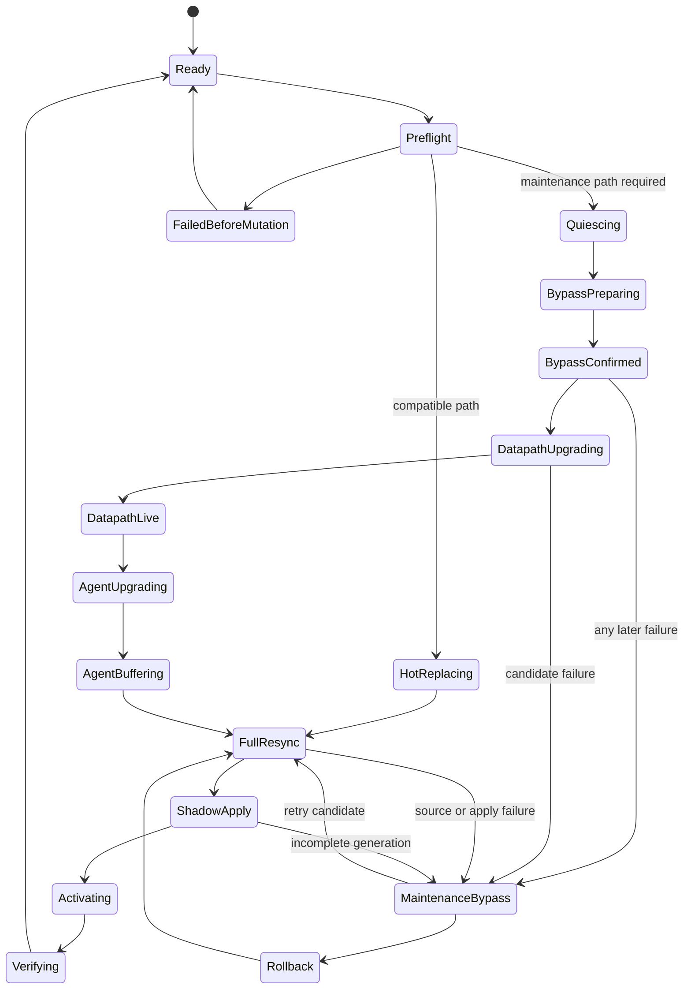

# Aria Planned Maintenance Upgrade And Recovery Design

## Status

Approved target design for upgrading `neutron_aria_agent` and
`aria_datapath` on an OpenStack compute node.

This document supersedes the target lifecycle and health semantics in:

- `2026-08-17-kolla-ebpf-runtime-safe-upgrade-design.md`;
- `2026-08-17-aria-container-healthcheck-design.md`.

Those documents remain useful as descriptions of the current RC implementation.
This design defines the next implementation contract. It does not claim that
all maintenance APIs and probes described below already exist.

The v0.9 implementation profile in section 1.2 is normative for the first
implementation. Later optimizations must not silently widen that profile.

## 1. Objective

Aria is an enhancement of the existing OVS datapath. A planned Aria upgrade
may temporarily suspend ACL enforcement, but it must not interrupt the base
OVS forwarding path.

The product contract is:

> For an upgrade that cannot safely preserve a proven last-known-good ACL,
> enter an explicit and auditable ACL maintenance bypass, upgrade the two Aria
> containers, rebuild desired state from authoritative Neutron data, stage a
> complete new generation, and restore enforcement only after convergence is
> proven.

This is an availability-first planned-maintenance contract. It deliberately
accepts a bounded ACL enforcement gap. It does not weaken explicit ACL denies
outside the maintenance window and it does not claim that OVS, the physical
network, or the host can never fail.

### 1.1 Current-To-Target Gap

The current RC installer already validates images, preserves rollback
containers, records OVS identity, supports hash-aware migration, stops the
Python writer for an incompatible runtime, deletes exact managed ports, and
waits for a fresh full-resync. Those mechanisms remain useful.

The following target mechanisms are not yet implied by the current installer
and must be implemented explicitly:

- release-manifest-based upgrade classification;
- an ACL domain maintenance gate and admin API;
- writer pause with maintenance-aware event handling;
- liveness/readiness separation for both containers;
- one coordinator for a joint datapath and Python-agent release;
- progress-aware full-resync and apply barriers;
- rollback that remains in maintenance until current Neutron state is rebuilt.

### 1.2 v0.9 Implementation Profile

The first implementation deliberately uses the smallest mechanism that closes
the upgrade safety contract:

- maintenance activation is host-wide for the ACL domain; no port leaves
  bypass before the complete host generation is staged and verified;
- Docker health remains readiness-based, so `degraded`, `blocked`, and
  maintenance `bypass` are visibly `unhealthy`; `/livez` is added for separate
  process supervision and diagnosis, not as the Docker health authority;
- the legacy Neutron profile does not require `revision_number`; convergence
  uses an RPC subscription plus two complete inventory reads with the same
  canonical desired hash and no event-buffer overflow;
- replacing the Python container may stop the old writer after quiesce. The
  old in-memory event buffer is never transferred to the new container;
- one joint host coordinator upgrades `aria_datapath` and
  `neutron_aria_agent`; the two existing component installers remain internal
  primitives and are not independent operator entry points for an
  incompatible joint release;
- v0.9 exposes phase, generation, desired hash, port counts, and
  `last_progress_at`; detailed rule-level progress metrics are deferred until
  evidence shows they are needed.

This profile intentionally defers per-port early activation, cross-container
event-buffer transfer, a Neutron snapshot watermark API, and blue-green
datapaths. These are optimizations, not prerequisites for the safe v0.9
maintenance path.

## 2. Non-Negotiable Invariants

1. The upgrade workflow must never stop, restart, recreate, or reconfigure
   `ovs-vswitchd` or `neutron-openvswitch-agent`.
2. It must not delete a Neutron port, change `br-int` membership, change an
   `ofport`, or modify `binding:vif_type`.
3. It may remove only TC/XDP/BPF objects whose exact Aria ownership is proven.
   Shared `clsact`, foreign filters, and foreign programs are outside its
   authority.
4. Merely stopping an Aria container is not proof of bypass. Pinned maps,
   links, and TC filters can remain active after userspace exits.
5. Bypass is complete only when both ACL directions return pass semantics to
   the existing OVS path, for example `TC_ACT_OK`.
6. A candidate generation is never reported as applied until generation,
   desired hash, hook identity, map state, and both directions are complete.
7. Neutron remains the policy authority. Release state contains identities and
   lifecycle evidence, never an alternative copy of ACL policy truth.
8. After a failed upgrade or rollback, the safe terminal state is explicit
   maintenance bypass with OVS forwarding preserved. It is never an unproven
   replay of stale ACL state.

## 3. Upgrade Classification

The installer must classify the change before mutating runtime state.

| Change | Default path | ACL behavior |
| --- | --- | --- |
| Python agent code only, compatible UDS and snapshot schema | Agent hot replacement | Keep proven last-known-good ACL |
| Python configuration only, compatible contract | Agent hot replacement plus authoritative full resync | Keep last-known-good until new state converges |
| Datapath userspace only, unchanged eBPF/map/WAL ABI | Compatible datapath replacement | Keep last-known-good when adoption is proven; otherwise fall back to maintenance bypass |
| eBPF object, map layout, hook ownership, WAL/runtime schema, or snapshot ABI changes | Planned maintenance | ACL maintenance bypass |
| Joint agent and datapath release | Planned maintenance | ACL maintenance bypass |
| Compatibility cannot be proven | Planned maintenance | ACL maintenance bypass |

The release manifest must expose at least:

```text
release_version
uds_schema_min
uds_schema_max
snapshot_schema_version
ebpf_abi_hash
map_schema_hash
wal_schema_version
runtime_state_schema_version
minimum_kernel_profile
managed_domain_contract_version
```

The classifier must compare manifests, not infer compatibility from only one
ELF file hash. An operator may force the more conservative maintenance path,
but may not force an incompatible candidate into the hot path.

### 3.1 First-Adoption Bootstrap

The first release containing the maintenance gate cannot ask the previous eBPF
program to open a gate that does not exist in its ABI. That one adoption is a
documented bootstrap exception:

1. use the current proven hash-aware installer to stop the Python writer and
   quiesce/detach only exact Aria-owned managed ports;
2. verify OVS forwarding and OVS/OVS-agent identity continuously;
3. install the gate-capable datapath and agent from one CI release manifest;
4. run authoritative full-resync, verify the complete host generation, and
   record the node as `maintenance_gate_capable=true`;
5. require every later incompatible or joint upgrade to use the transaction
   described by this document.

The bootstrap path is not a second permanent installer contract and must be
removed from normal operator instructions after all supported nodes are gate
capable.

## 4. Alternatives And Decision

### 4.1 Always Preserve Last-Known-Good

This avoids an ACL enforcement gap and is suitable for a compatible Python
agent update. It is unsafe as a universal strategy because a changed BPF/map
ABI may make the old pinned runtime impossible for the new process to adopt or
recover.

### 4.2 Planned Maintenance Bypass

This is the selected path for datapath-affecting and joint upgrades. It creates
a bounded, visible ACL gap but gives the strongest guarantee that an Aria
failure cannot block OVS forwarding.

### 4.3 Blue-Green Datapath

A future implementation could stage two complete datapaths and atomically
switch one host-wide epoch without any ACL gap. It requires duplicate maps,
more hook orchestration, additional legacy-kernel verifier budget, and a more
complex rollback protocol. It is not required for the current release.

## 5. Ownership And Component Boundaries

### 5.1 Host Upgrade Coordinator

The Kolla release script remains the host-local coordinator. It owns:

- the host lifecycle lock;
- release manifest and image validation;
- the durable upgrade ledger;
- container stop/start/rename operations;
- phase deadlines and rollback selection;
- OVS non-interference evidence.

It does not read or compile ACL policy and it does not mutate OVS.

### 5.2 neutron_aria_agent

The Python agent owns:

- Neutron API/RPC consumption;
- writer quiesce and event buffering;
- authoritative full-resync construction;
- generation and desired-hash submission;
- convergence polling and status publication.

It does not read OVSDB, attach eBPF, or manipulate TC.

### 5.3 aria_datapath

The Rust datapath owns:

- durable maintenance state;
- ACL domain gate state;
- WAL intent/commit/replay;
- shadow map preparation and active-bank switching;
- TC/BPF identity validation;
- per-port apply, bypass, and cleanup status.

### 5.4 Neutron Server

Neutron Server remains available during a compute-node upgrade. Operators may
continue changing ACL objects and ports. The agent must therefore buffer events
and reconcile from authoritative state before enforcement is restored.

## 6. Durable Upgrade Ledger

The coordinator stores a root-owned, mode-0600 ledger under a dedicated release
state directory. Updates use write, `fsync`, and atomic rename.

Required fields are:

```text
schema_version
operation_id
host
phase
started_at
last_progress_at
upgrade_class
affected_domains
old_image_ids
candidate_image_ids
old_manifest_hash
candidate_manifest_hash
old_config_hash
candidate_config_hash
pre_accepted_generation
pre_applied_generation
pre_desired_hash
pre_managed_port_ids
maintenance_token
ovs_vswitchd_pid
ovs_agent_container_id
ovs_agent_started_at
br_int_uuid
last_error
recovery_action
```

Only one operation may own the host lock. Repeating a request with the same
`operation_id` is idempotent. A different operation is rejected while a ledger
is pending.

A stale ledger never expires into automatic ACL activation. Recovery reads the
ledger and either resumes the exact phase or remains in maintenance bypass for
operator action.

## 7. Target State Machine



Legal persisted phases are:

```text
preflight
quiescing
bypass_preparing
bypass_confirmed
datapath_upgrading
datapath_live
agent_upgrading
agent_buffering
full_resync
shadow_apply
activating
verifying
maintenance_bypass
rollback
committed
```

## 8. Detailed Planned-Maintenance Flow

### Phase 0: Stage Before The Window

Load both candidate images before any runtime mutation. Verify image IDs,
binary hashes, manifests, signatures, configuration syntax, Python import
compatibility, Rust/eBPF artifact identity, legacy-kernel profile, free disk
space, state paths, and rollback image availability.

This phase must not stop either Aria container and must not change ACL state.

### Phase 1: Preflight And OVS Canary

Record the current datapath and agent state, managed ports, generation/hash,
container identities, and OVS identities. Start two timestamped traffic probes:

- a managed-port probe that shows ACL behavior;
- an independent OVS canary that does not depend on the target ACL policy.

Any preflight ambiguity fails before mutation.

### Phase 2: Quiesce The Writer

The preferred agent behavior is `writer_paused + rpc_buffering`, not immediate
process termination. The service continues heartbeat and accepts RPC events
into a bounded merge buffer, but it cannot submit a snapshot or delete.

If the current agent does not implement quiesce, the current stop-container
fallback remains valid only after the coordinator has recorded that events
cannot be buffered. The post-upgrade path must then force authoritative
full-resync before activation.

The old agent's in-memory event buffer is not treated as durable policy truth.
When the agent itself is replaced, the new agent subscribes in buffer-only mode
before it starts the authoritative inventory read. Changes made before that
subscription are represented by the subsequent full read; changes racing that
read are represented by the new buffer. The old buffer may be retained for
audit, but correctness does not depend on transferring it between containers.

### Phase 3: Enter ACL Maintenance Bypass

The coordinator calls a root-authorized admin API with:

```json
{
  "operation_id": "uuid",
  "domains": ["acl"],
  "reason": "planned_upgrade",
  "expected_applied_generation": 123,
  "expected_desired_hash": "sha256:..."
}
```

Entering bypass is an explicit privileged maintenance action. It requires the
validated release ledger and matching operation ID, is written to the audit
log, and raises a maintenance alert. A normal health failure, Python exception,
or unauthenticated UDS request cannot open this gate.

The datapath writes WAL intent, persists the maintenance token, switches a
host-level ACL domain gate to bypass, verifies both packet directions, writes
WAL commit, and returns an asynchronous accepted result.

The host-level domain gate is preferred over sequential per-port delete:

- one state transition closes the race between ports;
- TC hooks may remain attached and inert;
- no repeated detach/reattach churn is required;
- future QoS, Mirror, and observability domains are not disabled merely because
  ACL enters maintenance.

The eBPF implementation uses one shared managed-runtime gate consulted before
per-tap ACL and conntrack configuration. When the ACL maintenance bit is set,
both ACL and its conntrack path are neutral while QoS, Mirror, and observability
retain their own feature state. Changing this shared map layout is an eBPF ABI
change and therefore always selects the maintenance path.

At the packet path, an ACL maintenance gate returns pass to the existing OVS
path. It must not skip unrelated modules that are still declared active.

The coordinator may proceed only after status proves:

```text
maintenance.operation_id matches
maintenance.domains contains acl
acl_enforcement = bypass
pending_generation is empty
both ACL directions are bypass
OVS canary is continuously successful
```

### Phase 4: Upgrade aria_datapath

Stop and preserve the old container as the rollback point. Start the candidate
with the persisted maintenance ledger mounted before it can reconcile or
attach runtime state.

Candidate startup ordering is mandatory:

1. load and validate configuration;
2. read the durable maintenance ledger;
3. force the ACL domain gate to bypass;
4. replay or quarantine runtime state without enabling ACL;
5. expose liveness and the admin/status API;
6. report `maintenance_bypass` readiness;
7. wait for a new authoritative snapshot.

An old pinned ACL must never become active merely because WAL replay succeeded.

### Phase 5: Upgrade neutron_aria_agent

Replace the Python agent after datapath liveness, UDS schema, peer credentials,
and maintenance identity are verified. The new agent starts in buffer-only mode
when it sees an active upgrade ledger.

This order allows the new Python agent to negotiate with the new datapath and
prevents it from submitting a schema the old datapath cannot understand.

For a classified compatible agent-only hot update, this phase is executed
without Phases 3 and 4: the existing datapath keeps the proven last-known-good
ACL, the old agent is replaced, the new agent subscribes, and an explicit
full-resync confirms or advances the generation before the operation commits.

### Phase 6: Build An Authoritative Snapshot

Do not wait for `resync_interval`. The coordinator requests one explicit
full-resync operation and receives its operation identity.

The v0.9 consistency algorithm is:

1. subscribe to RPC and buffer events;
2. read the complete host-effective Neutron inventory and compute canonical
   desired hash A;
3. merge or classify buffered events without assuming a revision number;
4. read the complete inventory again and compute canonical desired hash B;
5. require A == B and no buffer overflow, unsupported event, or foreign-host
   ambiguity;
6. otherwise discard the candidate and repeat the bounded double-read cycle.

The future optimal Neutron interface is a host-effective snapshot endpoint
that returns one transactionally consistent object set plus a watermark. Until
that exists, RPC buffering plus the second hash-stability read is normative.

New, deleted, or migrated ports during the maintenance window are handled by
this authoritative rebuild. The post-upgrade managed-port set is not required
to equal the pre-upgrade set.

### Phase 7: Shadow Apply

Submit one `generation + desired_hash` using the asynchronous accepted model.
The datapath writes candidate maps and hooks behind the inactive bank while the
ACL maintenance gate remains bypass.

The v0.9 apply progress contract exposes:

```text
phase
ports_done
ports_total
last_progress_at
accepted_generation
applied_generation
pending_generation
desired_hash
```

Rule-level progress is optional and must not block the first implementation.

The coordinator uses a no-progress timeout and a bounded absolute maintenance
deadline. A fixed short HTTP timeout is not an apply-failure signal. As long as
the same generation/hash continues making progress, it is not resubmitted.

### Phase 8: Activate The Host ACL Generation

The v0.9 host-level ACL maintenance gate may be cleared only after every port in
the authoritative host snapshot has complete ingress and egress state staged
and validated for the same generation and desired hash. Activation switches
the complete staged generation, verifies both directions, and then clears the
host ACL maintenance gate.

If any requested port cannot be staged, the host remains `degraded + bypass`.
No successfully staged port is activated early in v0.9. This avoids a second
per-port exception protocol underneath the host gate and makes rollback and
crash recovery deterministic.

### Phase 9: Verify And Commit

Commit succeeds only when:

- `pending_generation` is empty;
- `accepted_generation == applied_generation`;
- applied desired hash equals the authoritative desired hash;
- every requested port is terminal `ready/enforce` for the same generation;
- no unowned hook was changed;
- candidate image, binary, eBPF, config, and schema identities match;
- OVS and OVS-agent identities are unchanged;
- `br-int`, business ports, and ofports are unchanged by Aria;
- the independent OVS canary has no Aria-attributable interruption.

After commit, the Python agent leaves buffer-only mode, replays any final
trusted events, resumes normal RPC/polling, and the release ledger becomes an
immutable completed record.

## 9. Health And Readiness Semantics

The target contract exposes three distinct concepts while keeping Docker
health strict:

| Probe/state | Meaning | Maintenance result |
| --- | --- | --- |
| `/livez` | Process, main loop, and local API are responsive | HTTP 200 |
| `/readyz` | ACL state is fully classified and enforcement-ready | HTTP 503 |
| `/status` | Detailed maintenance, generation, port, and error evidence | HTTP 200 with `maintenance_bypass` |

Docker `HEALTHCHECK` continues to use strict readiness. Therefore a recognized
maintenance bypass is intentionally `unhealthy` in `docker ps`, while `/livez`
still proves that the process and local API are responsive. Monitoring and
release automation must consume both signals instead of treating Docker health
as proof that OVS forwarding failed.

`aria_datapath` liveness requires the Rust process, main loop, TCP health
endpoint, UDS listener, and bounded status response. It does not require ACL
enforcement.

`neutron_aria_agent` liveness requires its own service-loop heartbeat to be
fresh. It reports datapath reachability and ACL readiness as dependent state.
Its Docker health is nevertheless unhealthy while the ACL domain is bypassed.

Expected maintenance status is:

```text
service_liveness = alive
datapath_reachable = true
sync_state = maintenance
acl_enforcement = bypass
overall_readiness = degraded
reason = planned_upgrade_bypass
operation_id = <uuid>
```

An unknown or mismatched maintenance identity remains unhealthy/blocked; only
an explicit, matching maintenance operation is accepted as live-but-not-ready.

## 10. Admin API Contract

The target local API adds root-authorized administration routes distinct from
the Neutron writer routes:

```text
POST /api/v1/admin/maintenance/enter
GET  /api/v1/admin/maintenance
POST /api/v1/admin/maintenance/exit
POST /api/v1/admin/maintenance/abort
```

The v0.9 admin routes are served only on
`/run/aria/aria-admin.sock`, owned by `root:root` with mode `0600`. The existing
Neutron routes remain on `/run/aria/aria-agent.sock`, owned by the non-root
Python agent identity. The Neutron service identity cannot open a maintenance
bypass outside the approved upgrade transaction.

While maintenance is active, a normal Neutron mutation is fenced. Only a
full-host snapshot carrying the matching `maintenance_operation_id` may stage
candidate state. Port-scoped snapshots and delete routes remain blocked until
the host generation is activated or the operation is rolled back.

`enter`, `exit`, and `abort` are compare-and-swap operations over
`operation_id`, generation, desired hash, and current phase. Repeating the same
request is idempotent; conflicting identities return a conflict without
changing runtime state.

## 11. Failure And Recovery Matrix

| Failure point | Required result | Recovery |
| --- | --- | --- |
| Preflight or image validation | Old runtime unchanged | Correct artifact and retry |
| Quiesce fails before bypass | Old ACL remains active | Resume old agent or retry quiesce |
| Bypass cannot be proven | Do not stop old datapath | Repair gate/status; upgrade blocked |
| Candidate datapath cannot start | Stay maintenance bypass if already entered | Restore old container in maintenance mode |
| Candidate agent cannot start | Datapath stays live in maintenance bypass | Restore old agent or repair candidate |
| Neutron source unavailable | Stay maintenance bypass | Retry source/full-resync |
| RPC buffer overflow or revision gap | Do not activate candidate policy | Repeat authoritative full-resync |
| Shadow apply fails on one port | Entire host ACL gate remains bypass | Retry or roll back the complete host generation |
| Generation/hash mismatch | Block activation | Investigate identity; rebuild snapshot |
| Rollback candidate fails | Stay maintenance bypass, writer paused | Preserve ledger and require operator recovery |
| OVS identity changes | Mark upgrade failed; do not manipulate OVS | Escalate as external failure |

## 12. Rollback Design

Rollback is a new maintenance transaction, not a blind container rename.

```text
confirm or re-enter ACL maintenance bypass
  -> pause candidate writer and buffer events
  -> stop candidate agent
  -> stop candidate datapath
  -> restore old datapath image/config in maintenance mode
  -> restore old agent image/config in buffer-only mode
  -> negotiate old UDS/schema contract
  -> authoritative full-resync from current Neutron state
  -> shadow apply
  -> atomic host ACL generation activation
  -> verify OVS invariant
  -> commit rollback
```

The rollback path does not activate old maps solely because they existed before
the upgrade. Neutron objects may have changed during the window, so current
authoritative state must be rebuilt even when old binaries are restored.

## 13. Rolling Three-Node Operation

Upgrade one compute node at a time. Do not run concurrent maintenance bypass on
all compute nodes for the first release.

Because the selected maintenance path intentionally pauses ACL enforcement on
the affected host, the operation requires an approved maintenance window and a
visible security-impact acknowledgement. The coordinator records bypass start
and end timestamps. It never hides the gap by reporting ACL ready.

Recommended order:

```text
compute-1 canary
  -> functional ACL and rollback gate
  -> observation window
compute-2 second node
  -> repeat gate
compute-3 final node
  -> repeat gate
```

Optionally disable new scheduling and operator-driven migration into the node
during its maintenance window. Existing VM traffic remains on OVS and new port
changes are reconciled by the post-upgrade authoritative full-resync.

## 14. Observability And Audit

Every phase logs structured events containing operation ID, host, phase,
generation/hash, counts, elapsed time, and result. Logs must not contain tokens,
passwords, or full sensitive policy payloads.

Required metrics include:

```text
aria_upgrade_in_progress
aria_upgrade_phase
aria_upgrade_elapsed_seconds
aria_upgrade_failures_total
aria_acl_maintenance_bypass_ports
aria_acl_maintenance_bypass_seconds
aria_full_resync_progress_timestamp
aria_full_resync_retries_total
aria_upgrade_ovs_canary_failures_total
```

The Neutron heartbeat remains bounded summary data. Detailed port identities
belong in the Aria status API and dedicated CLI, not `neutron agent-show`.

## 15. Implementation Stages

### Stage U1: Health Semantics

- add datapath `/livez`;
- add Python service-loop heartbeat evidence;
- keep Docker health strict and readiness-based;
- preserve `/readyz` as strict ACL readiness;
- expose recognized maintenance status.

### Stage U2: Maintenance Transaction

- add durable admin maintenance API;
- add host-level ACL domain bypass gate;
- add operation ID, WAL intent/commit, replay, and compare-and-swap;
- prove both directions bypass and OVS forwarding continuity.

### Stage U3: Agent Quiesce And Full-Resync Barrier

- fence normal writers by maintenance operation identity;
- use the stop-container fallback for the old v0.9 writer after bypass is
  proven; do not transfer its in-memory event buffer;
- subscribe the new agent before its authoritative inventory reads;
- add explicit full-resync trigger and progress identity;
- add overflow/gap fallback and second-read hash stability;
- prevent periodic and RPC writers from racing the upgrade.

### Stage U4: Unified Joint Upgrade Coordinator

- consume release manifests and classify upgrade type;
- persist the expanded release ledger;
- orchestrate datapath-first, agent-second replacement;
- implement progress-aware deadlines and maintenance-safe rollback.

### Stage U5: Verification And Rollout

- unit and contract tests for every phase and replay point;
- container smoke for live/not-ready/maintenance distinctions;
- process-kill tests at each lifecycle checkpoint;
- active OVS canary throughout upgrade and rollback;
- one-node, two-node, then three-node rolling canary.

## 16. Acceptance Gates

The design is implemented only when all of the following pass:

1. Compatible agent-only upgrades preserve last-known-good ACL and do not
   restart datapath or OVS.
2. Datapath-affecting upgrades enter one explicit ACL bypass transaction before
   stopping the old datapath.
3. `/livez` remains successful during a recognized maintenance bypass, while
   `/readyz` and Docker health truthfully remain unhealthy.
4. Stopping either Aria container never causes an Aria-attributable OVS canary
   interruption.
5. A new datapath cannot reactivate old ACL before authoritative full-resync.
6. Changes made in Neutron during the window are included before enforcement is
   restored.
7. Duplicate operations are idempotent and conflicting operation IDs are
   rejected.
8. Full-resync and apply use progress-aware convergence without duplicate
   generations caused by a short client timeout.
9. A failed port prevents host activation; no port enforces the new generation
   until the complete host generation is staged and verified.
10. Rollback starts in maintenance bypass and rebuilds from current Neutron
    state rather than blindly activating stale pins.
11. OVS/OVS-agent identities, `br-int`, business ports, and ofports remain
    unchanged by Aria throughout upgrade and rollback.
12. Automatic recovery failure preserves the ledger, keeps unsafe writers
    paused, reports the exact phase, and leaves OVS forwarding available.

## 17. Explicit Non-Goals

- no cross-host distributed ACID transaction;
- no OVS or OVS-agent lifecycle ownership;
- no automatic reactivation after a stale maintenance lease;
- no requirement for zero ACL enforcement gap in the current maintenance path;
- no blue-green duplicate datapath in the current release;
- no per-port early activation under the host maintenance gate in v0.9;
- no cross-container transfer of an in-memory RPC event buffer in v0.9;
- no dependency on Neutron `revision_number` in the legacy profile;
- no QoS or Mirror policy implementation as part of this upgrade work.
